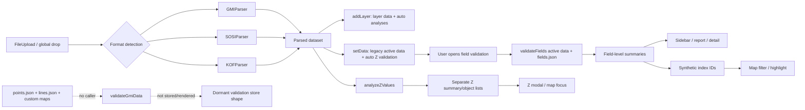
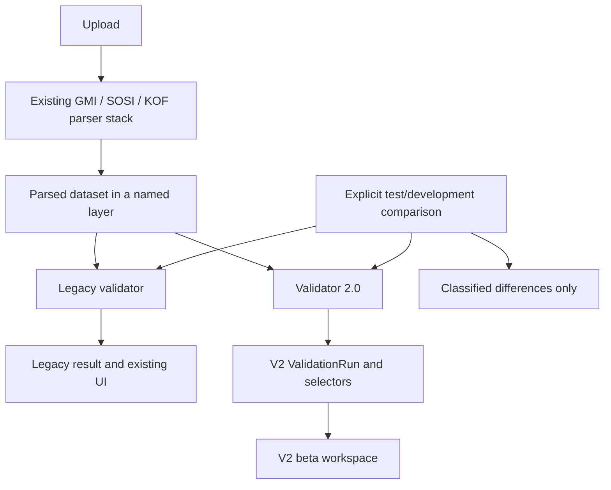

# Validation module audit and implementation plan

**Audit date:** 2026-08-20

**Requested branch:** `planning/validation-module-overhaul`

**Observed branch and commit:** `main` at `d6db722e2bbe6f47582a6e32453177940b32e33c`

**Scope:** architecture, maintainability, usability, testing, and migration planning only

> **Scope caveat:** the requested branch was not checked out and was not present in the local or remote-tracking refs available in this clone. Git reported `main`. This report therefore describes the inspected `main` working tree. Before implementation, confirm whether a separate planning branch exists elsewhere and compare it with this baseline.

No application code, tests, dependencies, configuration, database, or production settings were changed during this audit. The only intended working-tree change is this report.

## 1. Executive summary

The production field-validation UI is not powered by the rule engine documented in the repository. The actual UI calls `validateFields()` in `src/lib/validation/fieldValidation.js`, which reads the combined `src/data/fields.json` file and contains hardcoded alias, applicability, object-classification, status, and presentation-label logic. The separately documented `validator.js` + `rules/points.json` + `rules/lines.json` path has no runtime caller. Its custom rule registries are empty. The Zustand validation slice also has no producer or consumer and describes a third, incompatible result shape.

The effective validator supports two common checks: required-value presence and membership in an allowed-value list. It also has field-key-specific conditional applicability and reports values found on non-applicable objects as “unexpected.” Geometry Z validation is a separate, actively used procedural subsystem with its own result and UI model. Metadata such as `fieldFormat` and several `required` states is present but not consistently executed.

The largest extensibility problem is silent architectural drift: a developer following `README.md` and `docs/DEVELOPER_NOTES.md` can add a rule to the documented point/line registry and see no change in the application. Conditional or complex rules require editing field-key conditionals in the effective validator and potentially adding UI-specific labels. There are no validation-focused tests to detect omissions, rule drift, severity changes, or parser-to-validator regressions.

The largest user-experience problem is that validation is summarized by field, not represented as actionable failures. A user can see that a field is partly missing or has invalid values and can filter the map, but cannot see a structured list of affected objects with the value found, expectation, reason, source, or correction. The current “error/warning/OK” status is based partly on prevalence rather than rule severity: a required field missing from one object becomes a warning, while a field absent from every applicable object becomes an error. Shared point/line fields are aggregated together and then shown under both tabs, making the counts misleading.

The recommended target is a **hybrid typed rule registry**:

- declarative rule definitions for required fields, allowed values, formats, and other common evaluators;
- reusable, named applicability and object-classification predicates;
- specialised validator functions for genuinely complex or geometry/dataset rules;
- one validation-run/result contract with stable rule IDs, canonical object references, issue records, and per-rule summaries;
- UI selectors that group the same issue data by rule/problem, object, or severity without embedding domain policy in React.

Because the repository is JavaScript-only, begin with ES modules, JSDoc contracts, runtime registry validation, and `// @ts-check` where useful. Do not make a TypeScript conversion a prerequisite for this redesign.

The first implementation slice should be behaviour-preserving: add representative fixtures and characterization tests around the effective `validateFields()` path, document known legacy anomalies in those tests, and introduce a pure validation facade plus a canonical layer-aware object-reference adapter without changing the UI. This creates a parity baseline and the seam needed for incremental migration.

### Risk posture

No finding is classified **CRITICAL**. There is no observed server-side upload of validation content, database write, or production-configuration dependency in the validation path. Several findings are **HIGH** because they can silently produce incomplete or misleading validation and will make rule growth unsafe.

## 2. Current architecture

### 2.1 Modules inspected

Twenty-six validation-related implementation/configuration modules were inspected. Supporting documentation, the two bundled PDFs, `package.json`, Git history, and the complete test-file inventory were also inspected but are not included in the module count.

| Area | Modules | Current responsibility |
| --- | --- | --- |
| Application entry | `src/app/page.js` | Mounts upload, standard sidebar, field-validation sidebar, map, and Z modal based on store state. |
| Upload | `src/components/FileUpload.js`, `src/components/GlobalFileDrop.js` | Detects format, invokes the selected parser, writes layer and legacy dataset state. |
| Parsing/normalisation | `src/lib/parsing/gmiParser.js`, `sosiParser.js`, `kofParser.js`, `normalizeFeature.js` | Produces `{ format, header, points, lines, warnings, errors, crsContext }`; each feature has geometry and an `attributes` object. |
| State | `src/lib/store.js` | Holds legacy `data`, layers, UI filters, Z results, and a dormant generic validation slice. |
| Effective field validator | `src/lib/validation/fieldValidation.js` | Runtime field checks, aliases, pressure/gravity classification, conditional applicability, aggregation, statuses, and map failure IDs. |
| Dormant engine | `src/lib/validation/validator.js` | Uncalled point/line required and allowed-value engine with custom hooks. |
| Rule/config data | `src/data/fields.json`, `src/data/rules/points.json`, `src/data/rules/lines.json` | Three overlapping representations of field requirements; only `fields.json` feeds the active UI validator. |
| Dormant custom rules | `src/data/rules/custom/point-logic.js`, `line-logic.js` | Empty custom rule maps imported only by the dormant engine. |
| Field-validation UI | `src/components/FieldValidationSidebar.js`, `MissingFieldsReport.js`, `FieldDetailModal.js` | Computes field summaries, filters by geometry/status, displays details/value distributions, and drives map filtering. |
| Validation entry/navigation | `src/components/Sidebar.js`, `LayerManager.js`, `LayerPanel.js` | Opens validation and exposes per-layer controls; the field-validation action does not pass the chosen layer. |
| Data/map integration | `src/components/LayerDataTable.js`, `MapView.js`, `MapInner.js` | Reuses field labels and maps synthetic validation IDs to rendered features. |
| Geometry Z validation | `src/lib/analysis/zValidation.js`, `src/components/ZValidationModal.js` | Separate active validation-like check, result model, summary, object list, and map navigation. |

### 2.2 Architectural reality versus repository documentation

`README.md:122` says field rules are defined in `src/data/rules/`, and `docs/DEVELOPER_NOTES.md:39-45` says the point/line JSON plus custom modules and `validator.js` form the rule engine. Actual imports and calls show otherwise:

- `validator.js` imports `points.json`, `lines.json`, and both custom modules, but no other module imports `validateGmiData()`.
- `FieldValidationSidebar.js:33-35` and `MissingFieldsReport.js:37-39` call `validateFields(data)` directly.
- `fieldValidation.js:1` imports `fields.json`, not the point/line rule files.
- `store.js:437-462` exposes generic validation actions, but there are no callers of `setValidationResults()` or readers of that slice outside dormant selectors.
- The active field-validation result is an array of field summaries. The dormant engine returns `{ valid, errors, stats }`. The store expects `{ records, summary, errors, warnings, fieldStats }`. These shapes are mutually incompatible.

This is not merely dead code. It creates a false authoring path that can accept changes without affecting production behavior.

### 2.3 High-level runtime flow



## 3. Current validation data flow

### 3.1 Upload and parser output

`FileUpload.js:93-317` is the common file-loading entry used by both the upload control and `GlobalFileDrop`. It:

1. identifies GMI/SOSI/KOF from extension or content;
2. invokes `GMIParser.toObject()`, `SOSIParser.parse()`, or `KOFParser.parse()`;
3. rejects parser errors or an empty point/line dataset;
4. classifies/prompts for CRS;
5. calls `addLayer({ file, data })` and then also writes the same dataset to legacy `setData(data)`;
6. marks parsing complete.

All parsing and validation run in the browser. The Zustand persistence `partialize` configuration does not persist uploaded datasets or validation results. No field-validation export exists, and the audit found no field-validation network call.

The shared dataset shape is sufficiently consistent for the current validators:

```text
dataset
  format
  header
  points[]
    id, type="point", attributes, coordinates[], guid/extent where available
  lines[]
    id, type="line", attributes, coordinates[], guid/extent where available
  warnings, errors, crsContext
```

GMI builds this shape directly. SOSI and KOF use `normalizeFeature()`. Normalisation standardises geometry but does not canonicalise field names or business object types.

### 3.2 Object and type identification

There are several overlapping meanings of “type”:

- Geometry is identified by membership in `points` or `lines` and by feature `type`.
- Rule `objectTypes` contains the Norwegian geometry groups `punktobjekter` and/or `ledninger`.
- Business object codes are represented primarily by `Tema_punkt`/`Tema_led`, resolved through aliases such as `S_FCODE`, `Tema`, and `FCODE`.
- SOSI infers an `S_FCODE` from `objekttypenavn` using hardcoded mappings in `sosiParser.js:15-70`.
- KOF derives `S_FCODE` heuristically from code/name/section fields.
- Pressure versus gravity is inferred inside `fieldValidation.js:62-115` from object code, `Nett_type`, material, or the presence of `SDR`/`Trykklasse`; unknown cases default to gravity.

There is no canonical domain object or classification record shared by parsers, validators, map, and UI. Classification policy is therefore partly parser-specific and partly validator-specific.

### 3.3 Attribute access

`fieldValidation.js:3-28` defines aliases for eleven logical fields. `getValue()` then tries:

1. exact field-key match;
2. configured aliases;
3. generic case-insensitive key lookup.

The resolved source key is discarded. A validation result cannot tell the user whether, for example, `S_FCODE`, `Tema`, or `FCODE` was actually checked. The dormant engine does only exact `feature.attributes[rule.fieldKey]` lookup, so the two engines would not agree on SOSI/KOF or aliased GMI input.

### 3.4 Active field-validation execution

Field validation is lazy: it runs when `FieldValidationSidebar` or `MissingFieldsReport` renders, not as part of upload completion. `validateFields()` loops over all 46 entries in `fields.json`, then over applicable points and/or lines for each field.

For each feature it:

- determines field-specific applicability;
- resolves the value through aliases;
- counts present, valid, missing, invalid, and unexpected values;
- stores a value-frequency table;
- appends a synthetic failing ID based on geometry and array index.

It then emits one summary per field and sorts `Tema_*` first, followed by error, warning, and OK.

The validator does not emit one record per failed rule/object. This means object-level facts are collapsed before React sees them.

### 3.5 Result representation and aggregation

The active field result is approximately:

```text
{
  ...entire field definition,
  conditionLabel,
  stats: {
    total, present, valid, missing, invalid, unexpected,
    completion,
    valueCounts
  },
  failingIds: ["punkter-0", "ledninger-3", ...],
  status: "ok" | "warning" | "error"
}
```

Aggregation occurs across every geometry listed by a field. The 17 common fields therefore combine point and line counts into one result. The UI then shows that same combined result in both geometry tabs, and `MissingFieldsReport` copies it into both point and line sections. It does not calculate geometry-specific subsets.

Status is calculated at field-summary level:

- `error`: an `always` field is absent from all applicable objects;
- `warning`: an `always` field is partly missing or has invalid values; a `conditional` field has missing values; or a value exists where the hardcoded applicability says the field does not apply;
- `ok`: everything else.

This is not a true severity model. One required-field failure is a warning while many identical failures can turn the same rule into an error.

### 3.6 Map integration

Validation uses array-position IDs such as `punkter-4` and `ledninger-7`. `MapInner.js:1908-1955` independently converts data to GeoJSON and replaces parser IDs with array indices. `MapInner.js:2147-2164` builds base and layer-prefixed IDs and allows either to match.

This has three consequences:

- Parser `id`/`guid` is not the navigation identity.
- Reordering/filtering data before validation or rendering can break identity.
- In multi-layer mode, a base failure ID such as `ledninger-3` can match index 3 in every visible layer because map matching accepts base IDs as a fallback.

The per-layer field-validation button in `LayerPanel.js:202-222` only opens the global sidebar. It does not pass `layerId` or layer data. The sidebar always validates `state.data`, which is the last dataset written through the legacy path. A button on an earlier layer can therefore validate the last uploaded dataset while visually appearing layer-specific.

### 3.7 UI presentation

The active UI has three views:

- `FieldValidationSidebar`: geometry tabs, status tabs, cards with field completion/counts, a detail overlay, hover highlighting, and “Vis objekter” map filtering.
- `MissingFieldsReport`: field-summary lists split into line and point sections, again with map filtering.
- `FieldDetailModal`: description, requirement label, summary statistics, allowed values, and a value-frequency table.

There is no validation export. “Rapport” is an in-app summary, not a downloadable artifact.

### 3.8 Separate Z-validation path

`analyzeZValues()` is active and independent. It treats null, undefined, non-finite, and zero Z values as invalid for every point coordinate and line vertex. `setData()` and `addLayer()` run it automatically; the layer controls can run/open it again. Its result contains a summary plus `missingPoints`/`missingLines`, each with array index, object label, missing coordinate indices, and coordinate count. `ZValidationModal` lists affected objects and supports map focus.

Z validation is structurally closer to an actionable result than field validation, but it still has no stable rule ID, source reference, severity, expected/actual structure, or shared result contract.

## 4. Existing rule inventory

### 4.1 Effective field-definition inventory

`fields.json` contains 46 effective field definitions: 17 common, 16 point-only, and 13 line-only.

| Metadata dimension | Count |
| --- | ---: |
| `required: always` | 34 |
| `required: conditional` | 4 |
| `required: optional` | 2 |
| `required: optionalAlt` | 3 |
| `required: geminiOnly` | 2 |
| `required: polygonExcluded` | 1 |
| Fields with non-empty `acceptableValues` | 23 |
| Fields missing a description | 17 |

The file also contains `fieldFormat` values (`Kode`, `Heltall`, `Tekst`, `YYYY`, `DD.MM.YYYY`, `Navn`, `Tall`, `Desimal`, and `Desimaltall`), ordering, Mongo-style `_id`, `__v`, and timestamps.

### 4.2 Rule categories that actually execute

| Actual category | Definition | Execution | Failure representation/UI | Difficulty of another rule |
| --- | --- | --- | --- | --- |
| Required field: unconditional | `required: "always"` in `fields.json` | Missing check in `checkFeature()`; status logic after aggregation | Missing count + failing index IDs. Error only if missing on all applicable objects; otherwise warning. | Easy only if exact field access and universal geometry applicability are sufficient. Add to `fields.json`; duplicate files remain a drift concern. |
| Required field: conditional applicability | A mix of `required`, field key, and hardcoded conditions in `isApplicable()` | Named field-key branches for `Ringstivhet`, `SDR`, `Trykklasse`, `Bredde (diameter)`, `Byggemetode`, `Kumform`, `Kjegle`, and `Type` | Missing/invalid/unexpected counts, generic condition label, map IDs. No structured reason per object. | Medium/high. Requires config plus edits to `isApplicable()` and usually `conditionLabel`; may require alias/classifier edits. |
| Allowed value | `acceptableValues[]` on 23 fields | Trimmed string equality, then numeric comparison tolerance | Invalid count and aggregate value table; detail shows allowed list. No object-to-actual-value mapping. | Easy for a static list, but must update the active config and avoid duplicate registry drift. |
| Forbidden/unexpected field by condition | Implicit inverse of hardcoded `isApplicable()` | If a value is present when applicability is false, increment `unexpected` | Warning field card/report; generic “Uventet (feil type)” wording | High because there is no explicit forbidden rule or reason metadata. It emerges as a side effect of conditional-required logic. |
| Geometry Z validity | Procedural `isValidZ()` in `zValidation.js` | Checks every coordinate; invalid means absent, non-finite, or zero | Separate summary and object lists, no shared severity/rule metadata | Medium. Another geometry check currently implies another analysis function, store wiring, controls, modal, and map integration. |
| Parser structural validity | Procedural checks in each parser and upload handler | Signature/shape/coordinate/CRS parsing checks before field validation | Parser errors block upload; warnings are separate from validation UI | Medium and parser-specific. This should remain a parser concern but needs a clear boundary from domain validation. |

### 4.3 Present but not actually executed as represented

These are not current rule categories despite appearing to be:

- **Field format/type validation:** `fieldFormat` is never read by either active check logic. Dates, years, integers, names, text lengths, and decimal formats are not validated from this metadata.
- **Custom field validators:** the custom point/line maps are empty and their engine has no caller. Even if connected, the dormant engine skips empty non-required values before invoking custom logic, so it cannot implement many conditional missing-field rules.
- **Stable severity:** active definitions have no severity. The dormant engine emits only `type: "error"`. Z results have no severity.
- **Dataset-level Innmålingsinstruks rules:** none were found in the field registry.
- **General numeric ranges, patterns, cross-field dependencies, or relational geometry checks:** none are represented in the active field-validation engine.

### 4.4 Required-state semantic gaps

Only `always` and `conditional` influence missing/invalid status. `optional`, `optionalAlt`, `geminiOnly`, and `polygonExcluded` are not interpreted by status logic.

All fields are still counted and all missing/invalid objects are appended to `failingIds`, regardless of required state. This can produce a green `OK` card with a “Vis objekter” button that filters to objects the validator called failing. Specific examples:

- `Bredde (diameter)` is `polygonExcluded`, is hardcoded as applicable only to selected object codes, but missing values do not affect status because `polygonExcluded` has no execution semantics.
- `AnleggsID` is `conditional`, but no condition is implemented; it is treated as applicable to every point and warns whenever any point lacks it.
- Optional fields with disallowed values can remain `OK` because invalid values only change status for `always` fields.

### 4.5 Dormant point/line registry inventory

`points.json` has 33 entries and `lines.json` has 30. Their union is the same 46 field keys as `fields.json`; 17 common definitions are duplicated across both files. The combined active file differs semantically in four places:

- `Type`, `Kumform`, and `Kjegle` are `always` in `points.json` but `conditional` in `fields.json`.
- `SDR` is `Kode` with string allowed values in `lines.json`, but `Desimal` with numeric values in `fields.json`.

The opaque `_id` and timestamps match across copies, including where semantic content differs. They therefore do not prove synchronization.

## 5. Innmålingsinstruks representation

### 5.1 Places where requirements are represented

Observed representations are:

1. `src/data/1701350286-innmalingsinstruks_rev_lrf_v3-1.pdf` — bundled 29-page “Innmålingsinstruks.”
2. `src/data/1701350380-innmalingsinstruks_rev_lrf_v3-1_vedlegg_a.pdf` — bundled “Innmålingsinstruks Vedlegg A, Spesifikasjon innmålingsfil, versjon 3.1 juli 2023.”
3. `src/data/fields.json` — effective field catalog/rule input.
4. `src/data/rules/points.json` and `lines.json` — dormant duplicated field catalogs/rule inputs.
5. `fieldValidation.js` — implicit conditional requirements, type heuristics, alias handling, and status semantics.
6. React text such as “mot innmålingsinstruks,” requirement badges, condition labels, allowed-value descriptions, and explanatory copy in field details.

`StandardsInfoModal.js` describes separate incline requirements attributed to Norsk Vann/VA-Norm. Those requirements were not assumed to be part of the Innmålingsinstruks field-rule source.

### 5.2 Source-of-truth assessment

There is no repository-wide single source of truth.

- At runtime, `fields.json` plus the hardcoded branches in `fieldValidation.js` jointly form the effective truth.
- The point/line JSON files duplicate the same catalog and are presented by documentation as authoritative, but are disconnected from the UI.
- The PDFs are source documents but are not programmatically linked to any rule.
- UI wording and `conditionLabel` encode further policy/presentation meaning outside the definitions.

Field definitions and validation rules are mixed. A single JSON object contains field label/description, display order, nominal format, object geometry, required state, and allowed values. Conditional applicability is elsewhere. This makes it impossible to inspect one object and know the complete executed rule.

### 5.3 Identity and source metadata

Each field has a unique Mongo-style `_id`, `createdAt`, `updatedAt`, and `__v`. The active validator spreads this metadata into results, but no runtime code uses it. These IDs identify exported field records, not individual validation rules; one field can need several rules, and the same ID is duplicated across files. They should be retained only as migration/provenance data if useful, not adopted as the public rule identity.

No `ruleId`, source section, page, table, requirement identifier, rule version, remediation, or source URL/path was found. Descriptions and allowed-value descriptions are the only explanatory metadata, and 17 of 46 field descriptions are absent. Requirements are explicit only for basic required states and allowed values; conditions and status policy are implicit in code.

### 5.4 Domain-policy caution

The repository shows what the application currently does, not whether that behavior correctly reflects the instruction. In particular, the pressure/gravity heuristic, object-code lists for point fields, zero-as-missing Z policy, and meanings of `optionalAlt`, `geminiOnly`, and `polygonExcluded` require domain confirmation before being normalized into a new architecture.

## 6. Extensibility analysis

### 6.1 What a developer must do today

#### A. Add a simple required field

For production UI behavior, add the field to `fields.json` with geometry and `required: "always"`. If the developer follows repository documentation, they will instead or additionally edit `points.json`/`lines.json`. Updating only those documented files has no effect. To avoid drift today, all applicable copies, descriptions, ordering, values, and IDs must be reconciled manually.

No test fails if the field is placed in the wrong file, misspelled, omitted from the combined file, or assigned an unsupported required state.

#### B. Add or change an allowed-value rule

Update `acceptableValues` in `fields.json`, and likely the corresponding point/line copy. The active engine will enforce it for non-empty values. The detail UI automatically lists values, which is a useful existing property. However, engine comparison and detail-view comparison differ: the engine trims and accepts numerically equivalent values, while `FieldDetailModal.js:16-21` uses exact string equality. A value can therefore be accepted by validation and labelled invalid in the value distribution.

#### C. Add a conditional requirement

Add/update JSON, then edit `isApplicable()` with a new `field.fieldKey` branch. If users need a condition badge, edit the separate `conditionLabel` switch. If the condition needs an alias or classification input, edit `FIELD_ALIASES` and/or `getPipeType()`. The rule condition, explanation, and applicability reason are duplicated conceptually across these areas.

This design scales linearly in conditionals and creates a switch-like module where every new rule can affect every existing field.

#### D. Add a custom/complex field rule

The documented custom registry is not available to the active UI. Adding a function there does nothing. The practical option is to modify `fieldValidation.js`, extend its aggregate counters/result shape, and then update React if the new failure does not fit missing/invalid/unexpected. There is no exception isolation, evaluator contract, or rule-level test harness.

#### E. Add a geometry or dataset rule

The Z example indicates the current pattern: create a separate analysis module, add store fields/actions, execute during `setData`/`addLayer`, add buttons/prompts/modal UI, and add map ID handling. This duplicates infrastructure and produces another result model.

### 6.2 Failure and maintenance risks

- **Silent omission:** documented rule files and custom hooks have no active consumer.
- **Inconsistent requirement semantics:** six `required` values exist; only two affect missing status.
- **Inconsistent severity:** severity is inferred from aggregate prevalence, not defined by the rule.
- **Inconsistent messages:** domain explanation lives in descriptions, hardcoded condition labels, and component terminology; there is no shared message contract.
- **Object-type coupling:** conditional rules depend on field-name switches and a heuristic classifier with a gravity default.
- **Parser coupling:** aliases and SOSI/KOF inferred codes determine applicability but are not represented in results or tested through validation.
- **UI coupling:** a novel failure category requires React changes because results are fixed aggregate buckets.
- **Silent rule failure:** unsupported metadata is accepted without runtime schema validation, and no contract test proves that every rule has an evaluator.
- **Scale cost:** execution is roughly fields × features and performs repeated attribute-key scans. Both sidebar and report can compute the same full result independently.

The current design will not remain manageable as rule count and rule diversity grow substantially.

### 6.3 Architecture options

| Approach | Strengths in this repository | Weaknesses in this repository | Assessment |
| --- | --- | --- | --- |
| Keep current procedural validator | Lowest immediate change; easy to debug one function | Grows field-key branches; metadata and UI drift; weak contracts; parallel systems remain | Not suitable as the target. Keep only behind a compatibility facade during migration. |
| Pure JSON/config engine | Non-developers can inspect data; simple static rules are compact | Conditions/functions need a DSL or magic strings; weak validation in current JS setup; debugging and migrations become harder; complex geometry rules fit poorly | Do not adopt as the sole model. JSON can remain for pure value catalogs if validated. |
| Typed/declarative TypeScript rules | Strong discriminated unions, autocomplete, exhaustive evaluator handling | Repository has no TypeScript/tooling today; conversion adds unrelated migration cost | Good long-term option if TypeScript is independently adopted, but not a prerequisite. |
| Registry of procedural validators | Simple execution contract and custom logic | Repeats metadata and boilerplate for basic required/allowed rules; less inspectable/documentable | Useful as the extension point, not as the whole design. |
| Schema/config plus reusable evaluators | Compact common rules, systematic tests, metadata available to UI | Requires a clean condition/applicability model and config validation | Strong for common field rules. |
| Hybrid declarative rules plus specialised validators | Makes simple rules simple, retains an escape hatch, supports shared result metadata and UI | Requires an upfront result contract, stable IDs, and disciplined registry validation | **Recommended.** Best fit for current and expected rules. |

### 6.4 Stable rule identity and useful metadata

Stable identity should identify a check, not merely a field. Suggested IDs are human-readable and namespaced, for example `innmaling.common.height-reference.required` or `innmaling.geometry.z.present`. Exact naming should be decided once and tested for uniqueness.

Material metadata for this application:

- required: `id`, `title`, `category`, default `severity`, `appliesTo`/`when`, evaluator/check, and fields read;
- strongly recommended: concise expectation, user explanation, remediation/help, and source reference where verified;
- useful for compatibility: rule-set revision and optional legacy field/export ID;
- optional: tags/order for UI organization.

Avoid forcing irrelevant fields onto every complex rule. For example, a dataset-level rule may have no single `fieldKey`; a source reference may remain explicitly unknown until domain mapping is completed.

Stable IDs improve:

- tests that target behavior rather than mutable Norwegian text;
- grouping of thousands of issues by one problem;
- UI routing and expansion state;
- debug logs and reproducible defect reports without including uploaded values;
- generated rule documentation;
- future aggregate analytics if separately approved later;
- compatibility adapters when wording or implementation changes.

This plan does not add telemetry or analytics.

## 7. Result-model analysis

### 7.1 Information retained and lost today

| User question | Active field result | Z result |
| --- | --- | --- |
| Which object failed? | Only synthetic index IDs in `failingIds`; no visible object list | Geometry/index and label are retained |
| Which rule failed? | Field key only; missing/invalid/unexpected are counters, not rule IDs | Implicit single Z rule |
| Which field/source key was read? | Logical field key; resolved alias is lost | Coordinate index only |
| What actual value was found? | Aggregate `valueCounts`; not mapped to the failing object | Missing coordinate index; actual invalid representation lost |
| What was expected? | Indirectly available through required metadata and allowed list | Implicitly “non-zero finite Z” in code/UI text |
| Severity? | Aggregate `status`; not per issue and prevalence-dependent | None |
| Why did it apply? | Generic `conditionLabel`, not per object | Applies to all geometry by code |
| How should it be fixed? | Description/allowed list only | No remediation beyond having a valid Z |
| Source/reference? | None | None |

The largest information loss occurs inside `validateFields()`: after checking an object, it keeps only counters, a value histogram, and an index ID. React cannot produce a precise explanation later without re-reading and re-running domain logic.

### 7.2 Recommended result contract

Use a run-level result with sparse issue records and compact per-rule summaries. Do not emit a full “pass” object for every object/rule pair; that would scale poorly. Per-rule summaries can explain what was checked and how many passed/skipped, while issue records contain only failures.

Conceptual contract:

```text
ValidationRun
  runId                  local ephemeral ID
  ruleSetRevision
  datasetRef             layer/dataset identity; no filename required
  summary                checked/applicable/passed/issue counts by severity
  ruleSummaries[]
    ruleId
    applicableCount
    passedCount
    issueCount
    skippedCount + structured reasons where useful
    highestSeverity
  issues[]
    ruleId
    code                  e.g. required.missing, value.notAllowed
    severity
    objectRef
      layerId
      geometryKind
      sourceId or guid when available
      index fallback
      displayLabel (safe, optional)
    fields[]
      canonical field ID
      source key used (when useful)
    actual
      kind: missing | value | invalidType | invalidGeometry
      safe preview only when allowed
    expected             structured present/oneOf/predicate summary
    explanation          or message parameters resolved from rule metadata
    remediation          inherited/overridden from rule
    details              evaluator-specific, bounded and structured
```

Rule metadata should remain in the registry; results should reference it by ID rather than copying large allowed-value tables and database metadata into every result. A presentation selector can join issues to registry metadata.

### 7.3 Privacy and uploaded-data handling

Validation is client-side and current upload data is not persisted by the store, which is a good baseline. The future model should preserve it:

- do not add result telemetry;
- avoid copying full free-text values, names, comments, IDs, or coordinates into every issue;
- represent missing values structurally;
- retain normalized codes/numbers only where they materially help correction;
- use bounded/truncated local previews for sensitive-capable fields and reveal full current values only on explicit object drill-down;
- do not persist validation runs containing uploaded values.

Current `valueCounts` can expose every distinct free-text value in the detail UI. This is local, not a server leak, but should be treated as an intentional on-screen data-inspection feature rather than a default validation payload.

## 8. UX analysis

### 8.1 What works today

- Geometry tabs and color/status cues provide a familiar entry point.
- Allowed code lists and descriptions are available without leaving the application.
- Value distributions can reveal systematic coding differences.
- Hover and “Vis objekter” connect field summaries to the map.
- The Z modal provides direct per-object navigation.
- Successful Z and report sections have explicit empty states.

These capabilities should be retained, not replaced by an unrelated UI.

### 8.2 Main usability problems

1. **The default view is `OK`.** Users opening validation first see passing fields rather than problems to repair.
2. **Counts are rule/field counts, not issue/object counts.** “Sjekker 30 felt” and status badges do not say how many objects fail or how many actionable issues exist.
3. **No overall outcome exists.** There is no clear dataset/layer pass, warning, or fail summary for field validation.
4. **Severity terminology is misleading.** “Mangler” means absent everywhere, “Delvis” combines partial missing, invalid, and unexpected, and a required failure on one object is only a warning.
5. **Shared-field counts are duplicated across geometry views.** A combined point+line result appears in both tabs and report sections.
6. **Affected objects are not listed.** The map can isolate them, but users cannot inspect object label/ID, actual value, and reason in a sortable list.
7. **Explanations are incomplete.** The detail has a field description and allowed values but not “what was checked / why this object / found / expected / fix / source.”
8. **Rule and result are conflated.** A field card represents presence, value validity, and unexpected applicability at once.
9. **Layer context is missing.** A layer-local button opens validation for legacy `state.data`, and map filtering can cross-match equal indices in other layers.
10. **Large cardinality is unbounded.** `failingIds` and `valueCounts` grow with the dataset; the value table renders every distinct value without pagination/virtualization. Many new rules will also make the card grid harder to scan.
11. **Filtering/sorting is limited.** There is no search, affected-count sort, rule category, object grouping, or combined problems view.
12. **Empty status filters lack an explicit state.** An empty card grid can look like a rendering problem.

### 8.3 Recommended evolution of the existing UI

Use the same sidebar/map context but change the information architecture once the result contract exists:

- Header: active layer/dataset, overall status, affected objects, error/warning issue counts, and checks run.
- Default “Problems” view: grouped by rule/problem, sorted by severity then affected-object count.
- Optional grouping selector: **Problem**, **Object**, **Severity**. These are alternate projections of the same issues, not separate validation systems.
- Rule row: title, expectation, severity, affected/applicable count, short reason/remediation, source badge when available, expand/collapse.
- Expanded rule: virtualized/paginated object list with safe object identity, actual/expected summary, and “Vis i kart.”
- Object view: all issues for one object, which is more useful when repairing a record holistically.
- Checks view: passing and skipped rule summaries so users can understand what was checked without flooding the issue list with pass records.
- Filters: geometry, severity, category, text search, and active layer; retain map filtering.
- Success state: explicit “no blocking issues” plus warning/check totals, avoiding an ambiguous empty grid.
- Value distribution: retain as a secondary diagnostic tab, with bounded rendering and clear privacy behavior.

Do not add export until users specify the required format, identifiers, value-redaction policy, and whether the report is a repair aid or formal compliance artifact. There is no existing export compatibility requirement.

### 8.4 Making rules understandable without React policy

React should render structured fields supplied by the registry/result join:

- `title`: what is checked;
- `description`/rationale: why it matters;
- issue `actual`: what was found;
- structured `expectation`: what was expected;
- `remediation`: what the user can do;
- `source`: where the requirement comes from;
- evaluator `details`: bounded rule-specific evidence.

Components should select layouts for expectation/actual kinds (missing, one-of, range, format, custom detail), not switch on field names or construct domain conditions. Norwegian wording can be generated from message templates keyed by issue code and parameterized by rule metadata.

## 9. Testing analysis

### 9.1 Current coverage

The repository has 13 `*.test.mjs` modules plus an ESM loader. No test imports or references:

- `validateFields()`;
- `validateGmiData()`;
- `analyzeZValues()`;
- the three field-validation React components;
- field/point/line rule JSON.

`richerUsageTelemetryParserIntegration.test.mjs` has eight tests that exercise real GMI/KOF/SOSI parser behavior for warnings, CRS, map projection, and telemetry-related integration. This is useful parser coverage, but it does not feed parser output into field or Z validation.

There is no `test` script in `package.json`. Existing tests are Node test-runner modules invoked outside the package scripts. No rule-level, engine, parser-to-validation, UI-result, regression, or edge-case coverage was found for validation.

### 9.2 Missing high-value cases

- required value missing on none/some/all applicable objects;
- all six current `required` states;
- allowed string, trimmed string, numeric equivalence, invalid code, and empty optional values;
- alias resolution and reporting of the source key;
- pressure/gravity/object-code applicability and unknown classification;
- shared point/line fields with geometry-specific counts;
- empty datasets and a geometry with zero objects;
- SOSI inferred object codes through validation;
- KOF disabled behavior versus direct-validator behavior;
- stable object references and multi-layer equal-index collisions;
- Z null/undefined/non-finite/zero/valid values and empty coordinate arrays;
- field detail validity parity with engine equality;
- large result grouping and deterministic ordering;
- malformed/duplicate registry entries and evaluator coverage.

### 9.3 Future testing strategy

1. **Characterization fixtures:** lock current effective behavior before migration, including known anomalies marked as legacy expectations.
2. **Evaluator unit tests:** table-driven tests for required, allowed value, format, range, and other reusable evaluators.
3. **Rule contract tests:** for every registry entry, assert unique stable ID, known fields/predicates/evaluator, valid severity/category, source shape, deterministic execution, and safe metadata.
4. **Parameterized declarative tests:** automatically verify common rules with generated missing/valid/invalid examples where the definition provides sufficient data. Keep domain-specific examples explicit.
5. **Classification tests:** test aliases, source format adapters, object codes, pressure/gravity decisions, and unknown outcomes independently from rule evaluation.
6. **Engine tests:** applicability, skip reasons, exception isolation, ordering, summaries, deduplication, and no raw-data persistence.
7. **Parser-to-validation integration:** representative GMI and SOSI fixtures should produce canonical object/attribute references and expected rule IDs. Add KOF only after product policy is decided.
8. **Legacy/new parity tests:** run both engines on fixtures during migration and compare normalized summaries/issues in tests or development-only diagnostics. Do not send comparisons externally.
9. **UI selector/component tests:** group by rule/object/severity, filter, empty/success states, count semantics, and actual/expected/remediation rendering.
10. **Regression fixtures:** every production validation defect should add a minimal fixture keyed to stable rule ID.

A declarative registry reduces repetitive tests for common mechanics but does not remove the need for domain examples. Contract tests should prove wiring; rule-specific tests should prove policy.

## 10. Technical debt and risk register

### 10.1 CRITICAL

No critical validation-specific finding was observed.

### 10.2 HIGH

| Finding | Evidence | Impact | Recommended control |
| --- | --- | --- | --- |
| Documented engine is disconnected from production UI | No caller of `validateGmiData()`; UI imports `validateFields()` | Rules can be added “correctly” per docs and silently never run | Establish one facade/registry; add call-graph/config contract tests; correct docs after migration starts |
| Three incompatible validation architectures/results | Active field array, dormant `{valid, errors, stats}`, dormant store records/summary shape; separate Z model | Every new rule type risks another one-off path and UI | Define one run/issue/rule-summary contract and adapters |
| Required/severity semantics can report incorrect status | Unsupported required states; prevalence-based error/warning; optional invalid can be OK | Users can receive green or low-severity summaries for real failures | Separate applicability, requirement, issue severity, and aggregate status; characterize first |
| Conditional policy is implicit and incomplete | Field-key branches; `AnleggsID` has no condition; `polygonExcluded` not interpreted | False positives/negatives and difficult rule review | Named predicates with domain-approved tests and structured skip reasons |
| Multi-layer validation targets/matches the wrong data | Layer button passes no layer; sidebar reads legacy `state.data`; base index IDs match all layers | User may repair the wrong layer/object or see unrelated map objects | Introduce canonical layer-aware object refs and explicit active validation layer |
| No validation-focused automated tests | No field/Z/rule/UI validation imports in tests | Rule growth and refactoring have no regression net | First migration slice must add characterization and contract tests |

### 10.3 MEDIUM

| Finding | Impact | Recommended control |
| --- | --- | --- |
| Point/line/common rule data is duplicated and has semantic drift | Inspecting or editing one file does not reveal runtime behavior | Canonical field catalog + one registry; temporary drift test |
| Shared field summaries combine points and lines, then appear in both tabs | Counts and map targets are misleading | Preserve geometry/object reference per issue; aggregate through selectors |
| Pressure/gravity classification uses heuristics and defaults unknown to gravity | Missing pressure indicators can change which fields are required; uncertainty is hidden | Return explicit classification with reason/confidence/unknown; domain decision for unknown |
| `fieldFormat` and four required states are inert metadata | Registry appears more capable than execution | Runtime registry validation and explicit evaluator mapping; do not enforce formats before policy confirmation |
| Field detail equality differs from engine equality | Accepted numeric-equivalent values can be displayed as invalid | One shared value comparator/evaluator result |
| Result aggregation loses actual value, source alias, applicability reason, and object identity | UI cannot explain failures precisely | Sparse issue records plus rule summaries |
| No stable semantic rule IDs/source references/remediation | Weak testing, debugging, documentation, grouping, and user guidance | Add namespaced IDs and verified metadata incrementally |
| Custom rule hook is empty, uncalled, field-key keyed, and unable to inspect skipped empty optional values | Apparent extension point is misleading | Replace with evaluator contract behind the active facade |
| Validation recomputes fields × features and can run in both sidebar/report; distinct values render unbounded | Large files/rule sets can become slow and memory-heavy | One cached run per dataset/rule revision; sparse issues; virtualized drill-down |
| Raw value distributions include free-text-capable fields | Local screen can expose names/comments beyond what validation needs | Make value inspection explicit and bounded; safe issue previews |
| SOSI is allowed while KOF is disabled, but source-format validation policy is undocumented | Users may interpret parser-adapted attributes as equivalent compliance | Decide supported rule scope per format and show it in run metadata/UI |

### 10.4 LOW

| Finding | Impact | Recommended control |
| --- | --- | --- |
| Mongo export metadata is carried into active results but unused | Noise and unnecessary payload | Keep only migration mapping; omit from runtime result joins |
| `README.md` and developer notes overstate rule-driven behavior | Misleads maintainers | Correct once the canonical path is chosen; immediately add a short current-state warning if implementation begins |
| Tracked `src/components/Sidebar.js.bak` is dead parallel UI code | Search/review noise | Remove in isolated cleanup after confirming no need |
| Unused `fieldsData` import in `LayerPanel.js` | Minor maintenance/lint noise | Mechanical cleanup later |
| Empty custom files imply capability that does not exist | Developer confusion | Remove after migration or mark clearly dormant until replaced |

## 11. Recommended target architecture

### 11.1 Design principles

1. One callable validation facade for all domain rules.
2. One canonical field/value catalog, separate from rule applicability and severity.
3. Declarative definitions for common checks; custom evaluators use the same result contract.
4. Explicit, named object classification and applicability with an `unknown` outcome.
5. Stable rule IDs and canonical layer-aware object references.
6. Sparse issues plus per-rule/run summaries for scale.
7. Domain/result code independent of React and Zustand.
8. Presentation selectors group data; components do not encode field-name policy.
9. All uploaded values remain client-side and unpersisted.
10. Legacy behavior can be adapted and compared until parity decisions are explicit.

### 11.2 Proposed responsibilities and structure

The exact filenames can change during implementation, but these boundaries are recommended:

```text
src/lib/validation/
  index.js                       public runValidation facade
  contracts.js                   JSDoc types, constants, runtime guards
  catalog/
    fields.js                    canonical fields, labels, aliases, formats
    valueSets.js                 reusable allowed-code catalogs
  classification/
    attributeResolver.js         canonical value + source-key resolution
    classifyObject.js            geometry, object code, pipe class, reasons
    predicates.js                named reusable appliesTo/when predicates
  rules/
    registry.js                  unique registry + validation
    common.js                    common field rules
    points.js                    point-specific rules
    lines.js                     line-specific rules
    geometry.js                  Z and future geometry rules
  evaluators/
    required.js
    allowedValue.js
    custom.js                    adapter/guard for specialised evaluators
  engine/
    validateDataset.js           iteration, applicability, exception isolation
    validateObject.js
  results/
    summarize.js                 run/rule/object/severity summaries
    selectors.js                 UI grouping/filtering/sorting
    legacyAdapter.js             temporary current field-summary adapter
```

Suggested UI boundary after the result model is ready:

```text
src/components/validation/
  ValidationWorkspace.js
  ValidationSummary.js
  RuleIssueList.js
  ObjectIssueList.js
  ValidationDetail.js
```

This is an evolution of the existing sidebar/detail/report, not a new application surface. The current components can initially consume `legacyAdapter` output.

### 11.3 Field catalog versus rules

A field catalog should answer “what is this logical field and how can it be found/displayed?” It may include canonical ID, source aliases, label, nominal data kind, and allowed-value-set reference.

A rule should answer “under what conditions must what expectation hold, at what severity, and why?” Multiple rules can reference one field. This separation prevents a single overloaded `required` string from trying to describe universal, conditional, source-format, and object-specific policy.

Allowed-value lists may remain data-like, but they must be imported through a validated module and referenced by ID. Executable conditions should be named functions, not a JSON expression language.

### 11.4 Classification boundary

`classifyObject(feature, context)` should return structured facts such as geometry kind, normalized object code, pipe class, and evidence/source keys. It must allow `unknown`; it should not silently convert uncertainty to gravity.

Rules then use named predicates such as `isGeometry("line")`, `objectCodeIn(...)`, or `pipeClassIs("pressure")`. Predicate names/reasons can be surfaced in debug detail and tested independently. Parser-specific inference remains in adapters/classification, not duplicated in every evaluator.

### 11.5 Execution and fault behavior

The engine should:

- validate the registry at startup/build/test time;
- resolve a canonical object reference once;
- classify each object once;
- evaluate applicable rules deterministically;
- catch evaluator exceptions, mark the run incomplete with a safe internal diagnostic, and avoid silently reporting success;
- distinguish `notApplicable`, `skippedUnknownClassification`, and `passed` in summaries where meaningful;
- return issues without mutating parser data;
- never use message text as identity.

## 12. Example future rule definitions

These examples demonstrate structure using requirements already represented in code. They are conceptual, not implementation and not confirmation that current business policy is correct.

### A. Simple required-field rule

```js
defineRule({
  id: 'innmaling.common.height-reference.required',
  title: 'Høydereferanse skal være angitt',
  category: 'required-field',
  severity: 'error',
  appliesTo: measuredPointOrLine,
  fields: ['heightReference'],
  expectation: present('heightReference'),
  remediation: 'Angi høydereferansen som ble brukt for objektet.',
  source: sourcePendingVerification('Innmålingsinstruks v3.1'),
});
```

The generic `present` evaluator emits a standard `required.missing` issue. No engine or React switch changes.

### B. Rule for selected object types

```js
defineRule({
  id: 'innmaling.point.build-method.required-for-selected-types',
  title: 'Byggemetode skal være angitt for aktuelle punktobjekter',
  category: 'required-field',
  severity: 'error',
  appliesTo: allOf(
    geometryIs('point'),
    objectCodeIn(['KUM', 'LOK', 'SAN', 'SLS', 'SLU']),
  ),
  fields: ['buildMethod'],
  expectation: present('buildMethod'),
});
```

The object-code list mirrors current code only; domain owners must confirm it before migration.

### C. Conditional requirement

```js
defineRule({
  id: 'innmaling.line.sdr.required-for-pressure',
  title: 'SDR skal være angitt for trykkledning',
  category: 'conditional-required-field',
  severity: 'error',
  appliesTo: allOf(geometryIs('line'), pipeClassIs('pressure')),
  fields: ['sdr'],
  expectation: present('sdr'),
  onUnknownApplicability: 'skip-with-warning',
});
```

Classification uncertainty becomes explicit rather than defaulting silently.

### D. Allowed-value rule

```js
defineRule({
  id: 'innmaling.common.measurement-method.allowed-value',
  title: 'Målemetode skal bruke en tillatt kode',
  category: 'allowed-value',
  severity: 'error',
  appliesTo: measuredPointOrLine,
  fields: ['measurementMethod'],
  expectation: oneOf('measurementMethod', measurementMethodCodes),
});
```

The same comparator/result drives validation and the detail UI, eliminating current equality drift.

### E. Specialised complex/custom validator

```js
defineRule({
  id: 'innmaling.geometry.z.present',
  title: 'Alle koordinater skal ha gyldig Z-verdi',
  category: 'geometry',
  severity: 'error',
  appliesTo: measuredPointOrLine,
  fields: [],
  evaluate: evaluateGeometryZ,
  expectation: customExpectation('finite-nonzero-z'),
});
```

`evaluateGeometryZ` can return evaluator-specific coordinate indices in bounded `details`, but its issues still have the common rule ID, severity, object reference, expected value, and remediation contract. The rule can later be grouped with field issues without rewriting the engine or UI.

## 13. Migration strategy

> **Implementation sequencing update (parallel Validator 2.0 decision):** the in-place migration stages below are retained as the original audit recommendation, but they are superseded for implementation sequencing by the later section **“Validator 2.0 parallel-development strategy.”** The audit evidence and target design principles remain valid. New development should build an isolated V2 beside the unchanged legacy validator rather than route legacy execution through a new facade or progressively replace its internals.

### Stage 0 — Confirm baseline and domain ownership

- **Objective:** verify the intended branch and identify who approves rule semantics/source mapping.
- **Affected area:** repository process and domain review only.
- **Behavior change:** none.
- **Tests:** none.
- **Risk:** low, but proceeding on the wrong branch invalidates later parity work.
- **Parallel operation:** current production remains untouched.

### Stage 1 — Characterize current behavior

- **Objective:** create fixtures/tests for the effective validator, Z validator, aliases, current conditions, statuses, and known anomalies.
- **Affected area:** tests and test runner only.
- **Behavior change:** none.
- **Tests:** characterization/golden tests and config drift checks.
- **Risk:** low; tests must label questionable legacy behavior rather than endorse it as policy.
- **Parallel operation:** current implementation remains the only runtime path.

### Stage 2 — Add facade, contracts, and canonical object references

- **Objective:** introduce `runValidation`/contracts and layer-aware object references while delegating to legacy code through an adapter.
- **Affected area:** new validation foundation; minimal call-site wiring behind compatibility output.
- **Behavior change:** none intended.
- **Tests:** result contract, deterministic IDs, parser ID/guid fallback, equal-index multi-layer cases.
- **Risk:** medium around map navigation; keep current IDs in adapter until consumers migrate.
- **Parallel operation:** legacy evaluator remains active behind the facade.

### Stage 3 — Establish canonical catalog and validated registry

- **Objective:** create one field/value catalog and stable rule registry; generate or adapt current field summaries from it.
- **Affected area:** validation catalog/rules; no UI redesign.
- **Behavior change:** none intended.
- **Tests:** uniqueness, known evaluator/predicate, metadata schema, old/new config parity.
- **Risk:** medium due to 46-field data migration and existing semantic mismatches.
- **Parallel operation:** old JSON can remain temporarily and be compared in tests/development.

### Stage 4 — Migrate common evaluators with shadow parity

- **Objective:** move required and allowed-value checks to generic evaluators.
- **Affected area:** engine/evaluators; legacy adapter.
- **Behavior change:** none until discrepancies are reviewed.
- **Tests:** table-driven evaluator tests plus fixture parity.
- **Risk:** medium because current equality/status anomalies need explicit decisions.
- **Parallel operation:** run old and new on fixtures and optionally development-only local diagnostics; no telemetry.

### Stage 5 — Extract classification and conditional applicability

- **Objective:** replace field-key branches with named predicates and explicit classification outcomes.
- **Affected area:** aliases, object classification, conditional rules.
- **Behavior change:** preserve current behavior first; domain-approved corrections should be separate commits/slices.
- **Tests:** one fixture per current predicate, unknown classification, SOSI aliases/inference.
- **Risk:** high because it encodes business policy.
- **Parallel operation:** compare legacy/new applicability before switching.

### Stage 6 — Adopt the issue/result model

- **Objective:** emit sparse issues and rule summaries, then adapt them back to current field cards.
- **Affected area:** engine results, selectors, temporary adapter, store/cache.
- **Behavior change:** none in the first slice.
- **Tests:** grouping/count invariants, privacy bounds, result serialization, large fixtures.
- **Risk:** medium.
- **Parallel operation:** current UI consumes legacy-shaped selector output while new results are validated.

### Stage 7 — Bring Z validation behind the common contract

- **Objective:** register Z as a specialised evaluator without removing its existing modal behavior.
- **Affected area:** geometry rule and Z adapters.
- **Behavior change:** none intended.
- **Tests:** old/new Z parity and object navigation.
- **Risk:** medium, especially the zero-Z domain rule.
- **Parallel operation:** existing Z result adapter can remain until the modal migrates.

### Stage 8 — Correct known behavior one decision at a time

- **Objective:** resolve `required` semantics, severity, shared geometry counts, object classification unknowns, supported formats, and verified source metadata.
- **Affected area:** individual rules/predicates.
- **Behavior change:** explicit and reviewed per slice.
- **Tests:** focused regression and domain acceptance fixtures.
- **Risk:** medium/high depending on rule.
- **Parallel operation:** feature flags are unnecessary if slices are small; retain old/new fixture comparison until accepted.

### Stage 9 — Evolve the existing validation UX

- **Objective:** add overall summary, problem-first default, object drill-down, alternate grouping, clear explanations, and scalable lists.
- **Affected area:** validation sidebar/report/detail and map selectors.
- **Behavior change:** intentional presentation/count semantics changes, not rule-policy changes.
- **Tests:** selector/component contracts, empty/success/large states, map navigation.
- **Risk:** medium.
- **Parallel operation:** ship summary and drill-down incrementally while retaining current field details/value distributions.

### Stage 10 — Remove obsolete paths

- **Objective:** delete dormant engine/config/store shapes and update docs after all consumers migrate.
- **Affected area:** `validator.js`, old JSON copies/custom files, unused store selectors, backup file, docs.
- **Behavior change:** none.
- **Tests:** full validation and build suite.
- **Risk:** low after call-site proof.
- **Parallel operation:** no; removal is last.

### Stage 11 — Add new rule capabilities

- **Objective:** add domain-approved format, range, cross-field, geometry, or dataset rules through the established contracts.
- **Affected area:** isolated evaluators and rule definitions.
- **Behavior change:** new validation findings.
- **Tests:** evaluator contract + rule-specific domain fixtures + UX rendering.
- **Risk:** per rule; keep separate from architecture cleanup.
- **Parallel operation:** existing rules continue unchanged.

## 14. Prioritised implementation roadmap

Model/task labels follow the requested categories. “Sol review” is recommended for policy-sensitive or cross-cutting review, not as the primary implementer.

### FOUNDATION

| Task | Scope / why | Dependencies | Complexity | Risk | Model/task type |
| --- | --- | --- | --- | --- | --- |
| F1. Confirm branch baseline | Locate/compare `planning/validation-module-overhaul`; prevents implementing against the wrong tree | None | Small | Low | mechanical |
| F2. Add validation test command | Make Node validation tests discoverable/repeatable without changing app behavior | F1 | Small | Low | mechanical |
| F3. Add representative fixtures | Minimal GMI-like datasets for points, lines, aliases, conditional fields, shared fields, and layers | F2 | Medium | Low | Luna Medium |
| F4. Characterize `validateFields` and Z | Lock observed behavior, including explicitly named anomalies | F3 | Medium | Medium | Luna High; Sol review of anomaly labels |
| F5. Add config drift audit test | Assert point/line union, known mismatches, unique field keys/IDs, supported metadata values | F2 | Small | Low | mechanical |
| F6. Define checked JS contracts | JSDoc/runtime guards for Rule, Predicate, ObjectRef, Issue, RuleSummary, ValidationRun | F4 | Medium | Medium | Luna High; Sol review |
| F7. Introduce validation facade | Pure `runValidation(data, context)` delegating to legacy implementation | F6 | Small | Low | Luna Medium |
| F8. Canonical layer-aware object refs | Preserve layer, geometry, parser ID/guid, and index fallback; add map adapter | F6-F7 | Medium | High | Luna High; Sol review |

### RULE SYSTEM

| Task | Scope / why | Dependencies | Complexity | Risk | Model/task type |
| --- | --- | --- | --- | --- | --- |
| R1. Canonical field/value catalog | Consolidate 46 fields and 23 value sets; retain legacy IDs only as migration metadata | F5-F7 | Medium | Medium | Luna High; Sol review |
| R2. Registry validation | Unique rule IDs, known catalog refs, evaluator/predicate coverage, safe metadata | R1, F6 | Small | Low | Luna Medium |
| R3. Required evaluator | Generic present/missing evaluator with no status-prevalence policy | R2 | Small | Medium | Luna Medium |
| R4. Allowed-value evaluator | Shared string/numeric normalization used by engine and UI | R2 | Small | Medium | Luna Medium |
| R5. Legacy summary adapter | Reproduce current field card shape from new issues/summaries | R3-R4 | Medium | Medium | Luna High |
| R6. Attribute resolver | Extract aliases and return canonical value plus actual source key | R1, F4 | Medium | Medium | Luna High |
| R7. Object classifier | Extract geometry/object code/pipe class with evidence and `unknown` | R6 | Medium | High | Luna High; Sol review + domain review |
| R8. Named applicability predicates | Migrate each current field-key condition separately | R7 | Medium (several small slices) | High | Luna High; Sol/domain review |
| R9. Specialised evaluator guard | Standard return shape, exception isolation, bounded details | F6, R2 | Small | Medium | Luna High |

### RESULT MODEL

| Task | Scope / why | Dependencies | Complexity | Risk | Model/task type |
| --- | --- | --- | --- | --- | --- |
| M1. Sparse issue emission | Preserve per-object failure facts before aggregation | F6, R3-R4, F8 | Medium | Medium | Luna High |
| M2. Run/rule summaries | Checked/applicable/passed/failed/skipped counts with invariant tests | M1 | Medium | Medium | Luna High |
| M3. Grouping selectors | Pure grouping/filtering by rule, object, severity, geometry, layer | M1-M2 | Medium | Low | Luna Medium |
| M4. Safe actual-value policy | Field capability flags, bounded preview, no persistence/telemetry | M1, R1 | Small | Medium | Luna High; Sol review |
| M5. Per-layer result cache/store seam | Cache by layer/data identity + rule-set revision; eliminate duplicate React computation | F8, M1-M2 | Medium | Medium | Luna High |

### USER EXPERIENCE

| Task | Scope / why | Dependencies | Complexity | Risk | Model/task type |
| --- | --- | --- | --- | --- | --- |
| U1. Correct active layer context | Show/validate chosen layer and use layer-aware map IDs | F8, M5 | Medium | High | Luna High; Sol review |
| U2. Overall summary/problem-first default | Clear status, affected object and issue counts; retain checks view | M2-M3 | Medium | Medium | Luna Medium |
| U3. Rule issue drill-down | Actual/expected/reason/remediation and object map action | M1-M4, U1 | Medium | Medium | Luna High |
| U4. Object grouping | Show all issues for a selected object using same selectors | M3, U3 | Medium | Low | Luna Medium |
| U5. Severity/category/search filters | Scannability as rule count grows | M3, U2 | Small | Low | Luna Medium |
| U6. Large-list behavior | Virtualize/paginate object and distinct-value lists; deterministic sorting | U3-U5 | Medium | Medium | Luna High |
| U7. Source/help presentation | Render only verified source and remediation metadata | R1-R2, domain mapping | Small | Medium | Luna Medium; Sol/domain review |
| U8. Empty/success states and terminology | Clarify no-results states and separate severity from completion | U2 | Small | Low | Luna Medium |

### NEW RULE CAPABILITY

| Task | Scope / why | Dependencies | Complexity | Risk | Model/task type |
| --- | --- | --- | --- | --- | --- |
| N1. Format/type evaluator | Activate selected `fieldFormat` semantics only after domain definitions are approved | R2, M1 | Medium | High | Luna High; Sol/domain review |
| N2. Range/pattern evaluator | Reusable bounded numeric/text checks for future approved rules | R2, M1 | Small | Medium | Luna Medium |
| N3. Cross-field evaluator | Structured dependencies without field-key switches | R7-R9, M1 | Medium | High | Luna High; Sol/domain review |
| N4. Geometry custom migration | Move Z through registry/result contract, retain current modal adapter | R9, M1-M2, F8 | Medium | Medium | Luna High |
| N5. Dataset-level evaluator | Add only when a concrete requirement exists; support run-level objectRef absence | R9, M1-M2 | Medium | Medium | Luna High; Sol/domain review |

### CLEANUP

| Task | Scope / why | Dependencies | Complexity | Risk | Model/task type |
| --- | --- | --- | --- | --- | --- |
| C1. Remove dormant engine/config copies | Delete `validator.js`, point/line duplicates, and empty custom maps after parity | R1-R9, M1-M5 | Small | Low | mechanical; Sol review |
| C2. Remove/reconcile dormant store slice | One validation-run storage model | M5, all UI consumers migrated | Small | Low | mechanical |
| C3. Remove backup/unused imports | `Sidebar.js.bak`, unused `fieldsData` import, stale comments | Independent after verification | Small | Low | mechanical |
| C4. Correct architecture docs | Document actual authoring workflow, contracts, tests, and source mapping | After registry cutover | Small | Low | Luna Medium |
| C5. Performance pass | Benchmark representative large datasets after behavior stabilizes | M5, U6 | Medium | Low | Luna High |

## 15. Quick wins

### 15.1 Safe before the redesign

- Add validation characterization tests and a repeatable test command.
- Add a drift/contract script for the three existing JSON files, explicitly allowing only the four known semantic differences until consolidation.
- Add a short documentation warning that the UI currently uses `fields.json` + `fieldValidation.js`, while `validator.js` and point/line rule files are dormant.
- Add explicit empty text when a status filter has no fields.
- Change copy from “Sjekker X felt” to “X feltdefinisjoner” or similarly accurate wording; current number is not object checks.
- Reuse one computed result when moving from sidebar to in-app report, avoiding duplicate validation work without changing policy.
- Share the active engine’s value comparator with the detail value distribution so accepted values are not visually marked invalid.
- Remove the unused `fieldsData` import and, separately, the tracked backup file after confirming no operational dependency.

Even these should receive focused tests because validation wording and counts are user-facing.

### 15.2 Valuable but should wait for architecture/domain work

- Changing required-state or severity semantics.
- Enforcing `fieldFormat`.
- Consolidating/deleting rule files without a parity baseline.
- Changing pressure/gravity or object-code conditions.
- Making field validation automatic on upload.
- Adding stable IDs directly to the current overloaded field records without deciding one-field/multiple-rule identity.
- Adding raw actual values or downloadable exports.
- Redesigning the UI around object issues before issue records exist.
- Removing the Z subsystem before a common custom-evaluator/result adapter is proven.

## 16. Open domain questions and uncertainties

These questions cannot be answered reliably from the repository and must not be guessed during implementation.

### 16.1 Source and governance

1. Are the two bundled v3.1 PDFs the exact governing version for all current field rules, or are municipal/Gemini-specific additions also authoritative?
2. Which PDF section/page/table maps to each existing requirement and allowed-value set?
3. Who approves a source mapping and a change in validation behavior?
4. Should rule-set revisions be selectable, or is only one current instruction version supported?

### 16.2 Rule semantics

5. What precisely do `optionalAlt`, `geminiOnly`, and `polygonExcluded` mean, and can an invalid supplied value still be an error/warning?
6. Is `AnleggsID` conditional on a field/object property not represented in current code?
7. Are the hardcoded object-code lists for `Bredde (diameter)`, `Byggemetode`, `Kumform`, `Kjegle`, and `Type` correct and complete?
8. Is `Trykklasse` optional for pressure lines, forbidden for gravity lines, or governed by another condition?
9. Is `Ringstivhet` required for every gravity line, and is `SDR` required for every pressure line?
10. Should unknown pipe classification fail closed, warn/skip, or use a documented default?
11. Does a Z value of exactly zero always mean missing/invalid in every supported CRS/dataset context?
12. Are `fieldFormat` strings intended as enforceable rules? If so, what parsing, locale, ranges, text lengths, and null semantics apply?
13. Are allowed values case-sensitive, whitespace-sensitive, and numerically normalized as the active engine currently assumes?
14. Should a value on a non-applicable object be forbidden, informational, or ignored?

### 16.3 Object/source-format scope

15. Is Innmålingsinstruks field validation intended to apply equally to GMI and SOSI after alias/inference mapping?
16. Is KOF correctly excluded because it lacks required attributes, or should the UI run only the subset of applicable rules?
17. Which identity should users recognize: parser ID, GUID, GMI record number, SOSI `OBJID`, layer/index, or a composite?
18. For multi-layer uploads, should validation be per selected layer only, all visible layers, or both modes?
19. Are polygon-derived SOSI features considered lines for every rule, or only for visualization?

### 16.4 UX and reporting

20. Which severities block acceptance versus merely advise correction?
21. Should users see raw actual values for names, comments, links, and IDs in validation details/exports?
22. Is a downloadable report required, and if so, is it a repair worksheet or a formal compliance record?
23. What object/rule counts must appear in a formal summary?
24. Should passed and skipped checks be visible by default or only on demand?

### 16.5 Repository/process

25. Where is `planning/validation-module-overhaul`? It was neither current nor visible in local/remote-tracking refs during this audit.
26. Should the project adopt TypeScript independently, or should validation remain checked JavaScript for this overhaul?

## 17. Recommended first implementation slice

**Slice name:** Validation baseline, facade, and object-reference seam

**Objective:** make future migration measurable and layer-safe without changing any rule outcome or visible UI.

**Scope:**

1. Confirm/checkout the intended implementation branch.
2. Add a repeatable validation test command using the existing Node test approach.
3. Add small in-memory fixtures covering:
   - common point/line required fields;
   - none/some/all missing;
   - allowed string and numeric-equivalent values;
   - current aliases;
   - each hardcoded applicability branch;
   - the unsupported required-state behavior;
   - shared point/line aggregation;
   - Z null/zero/valid values;
   - two layers with the same object index.
4. Add characterization tests for `validateFields()` and `analyzeZValues()`. Mark questionable expectations with `legacy:` names and links to the open domain question; do not silently “fix” them.
5. Add a rule-data drift test that records the current 33 point, 30 line, 46 union/effective counts and the four known semantic differences.
6. Define JSDoc/runtime contracts for `ValidationContext` and canonical `ObjectRef`.
7. Add a pure `runValidation(data, context)` facade that delegates to the current validator and returns the current output through an adapter.
8. Add object-reference construction that includes `layerId`, geometry kind, parser ID/GUID when available, and index fallback. Do not switch all map consumers in this slice; prove mappings in tests and expose an adapter for current synthetic IDs.

**Explicit non-goals:** no rule consolidation, no changed statuses, no new severities, no format enforcement, no UI redesign, no Z migration, no telemetry, and no deletion of dormant files.

**Expected behavior change:** none.

**Complexity:** medium.

**Risk:** low for tests/facade; medium for object-reference work. Keep production call sites on the legacy adapter until equal-index multi-layer tests pass.

**Recommended execution:** Luna High for fixture selection/contracts and object-reference design; mechanical/Luna Medium for runner wiring; Sol review of the characterization boundary and proof that no behavior changed.

**Acceptance criteria:**

- all new characterization and contract tests pass deterministically;
- every known current rule path has at least one fixture;
- the facade is pure and has no React/Zustand dependency;
- no uploaded values/results are persisted or transmitted;
- equal object indices in different layers produce distinct canonical references;
- legacy UI output remains byte/structure-equivalent for the covered fixtures;
- application code behavior, dependencies, and production configuration remain unchanged.

## Validator 2.0 parallel-development strategy

### Decision and scope

The product decision changes the implementation sequence, not the original audit findings. The legacy field validator, its existing result shape, and its current UI remain an operational product path. Validator 2.0 is a second validator with an independent runtime architecture and an explicitly incomplete beta period.

The desired product flow is:



The shared boundary is the parsed dataset plus explicit layer context. V2 must not consume legacy field summaries, legacy severity/status, synthetic failure IDs, or legacy UI state in order to validate data. A comparison adapter may read both outputs in tests or development diagnostics, but it is outside the V2 execution path.

This section supersedes the original in-place migration stages and the original “Recommended first implementation slice” for sequencing. It does not remove or weaken the evidence, risk register, domain questions, target rule concepts, or testing recommendations above.

#### Hard invariant: every V2 run validates exactly one layer

Validation in Validator 2.0 is always per layer. This is a product and architecture invariant from V2-1 onward, not a future enhancement or UI preference. The complete public V2 input is exactly:

```js
{
  layerId,
  dataset,
}
```

`dataset` must be the parsed/normalized data belonging to that exact `layerId`. One invocation produces one run for that layer and no other layer. Opening validation from Layer A validates only Layer A; opening it from Layer B validates only Layer B. Switching A -> B creates or recomputes a B run from B's dataset. Any in-memory cache is keyed by layer identity, dataset identity/revision, and rule-set revision, so an A run can never be returned for B.

V2 must never validate all visible layers, merged layer data, `getVisibleLayersData()`, an implicit “current” dataset, or `state.data` without first proving that it is the dataset owned by the explicitly selected layer. “Validate all layers” is not a Validator 2.0 feature. If such a product capability is ever proposed, it requires a separate decision and must orchestrate distinct per-layer runs rather than weaken this contract.

### 1. Parallel product model

#### 1.1 User-visible model

The validation entry should become a small host that can mount either product path:

```text
Validering

[ Dagens validator ] [ Validator 2.0 (beta) ]
```

Rules for the host:

- `Dagens validator` is the initial and default selection.
- Selecting V2 does not mutate legacy data, results, filters, rule definitions, or severity semantics.
- V2 always receives the selected layer's explicit `{ layerId, dataset }`; the host must obtain `dataset` from that exact layer record.
- A legacy/V2 comparison is offered only when both invocations are demonstrably bound to that same `layerId` and exact layer dataset. Merely reading legacy `state.data` is not proof.
- The host labels the dataset/layer and validator clearly. It must never compare legacy output for one layer with V2 output for another.
- Switching validation from one layer to another reruns V2 or retrieves only a cache entry keyed by that layer, that dataset identity/revision, and the rule-set revision. It must not persist results or reuse another layer's run.
- V2 coverage is explicit: “4 beta rules evaluated” is acceptable; “dataset valid” without that qualifier is not.
- A V2 engine or render failure is contained by a V2 error boundary and an incomplete-run state. The legacy tab remains usable.
- Production should not automatically run both engines on every upload merely for comparison. Tests and explicit development diagnostics provide systematic comparison without adding runtime cost or data exposure.

The current per-layer legacy launcher is already misleading because it opens a validator that reads `state.data`. V2 must not reproduce that behavior. If legacy cannot safely be invoked with the selected layer dataset, the host must mark comparison as unavailable for that layer. The only alternative is a separately reviewed, minimal, output-preserving legacy integration that passes the selected `{ layerId, dataset }` explicitly and is protected by characterization tests. It is never valid to silently compare V2's selected layer with whatever dataset happens to be in legacy `state.data`.

#### 1.2 Runtime independence

Legacy and V2 should be sibling branches from parsed input:

```text
{ layerId, dataset }
        |
        +--> legacy invocation --> legacy field summaries --> existing components
        |
        +--> V2 input adapter --> ObjectRefs/classification --> V2 engine
                                                   --> ValidationRun --> V2 selectors/UI
```

V2 must be usable from the pure public call `runValidationV2({ layerId, dataset })`. The registry is owned by V2 composition, not supplied as an ambiguous alternate dataset/run scope. V2 must not import Zustand, React, a legacy result adapter, or `validateFields()`. The UI integration layer may read the existing layer store only to resolve the explicitly selected layer and pass its exact input object into V2.

#### 1.3 What can safely be shared

| Existing boundary/module | Sharing decision | Conditions |
| --- | --- | --- |
| `gmiParser.js`, `sosiParser.js`, `kofParser.js`, `normalizeFeature.js` | **Share directly** | Continue producing the parsed dataset. Do not fork or copy parsers for V2. Parser bugfixes remain parser work and require their own tests. |
| `layers[layerId].data` and layer `id`/`name` in `store.js` | **Share read-only as the input boundary** | A V2 container selects one exact layer and calls a pure V2 adapter. V2 core never imports the store. |
| Legacy `state.data` | **Do not use as V2 input or comparison evidence** | It is an implicit last/current dataset and is unsafe unless the integration proves object identity with `layers[layerId].data`. Prefer the explicit selected layer record. |
| Feature `attributes`, coordinates, parser `id`, and `guid` | **Share as immutable source facts** | V2 resolves canonical fields and creates its own ObjectRefs without mutating features. |
| Next.js/React application shell and existing CSS/Tailwind conventions | **Share as platform infrastructure** | V2 components remain in their own directory and do not import legacy validation components for domain rendering. |
| Existing map dataset/layers | **Share conditionally through a V2 navigation bridge** | Resolve an exact V2 ObjectRef and layer before calling map actions. Never pass a base index ID that can match another layer. |
| Bundled Innmålingsinstruks PDFs | **Share as read-only reference material** | A V2 rule cites a document location only after verification. The PDFs are not an executable registry. |

#### 1.4 What must not be shared as V2 runtime infrastructure

| Legacy module/data | Reason not to share |
| --- | --- |
| `src/lib/validation/fieldValidation.js` | Contains legacy alias, classification, applicability, aggregation, severity, and synthetic-ID behavior that V2 is intended to improve. It is used only by legacy and comparison tests. |
| `src/lib/validation/validator.js` | Dormant and incompatible with both active legacy results and the V2 target contract. |
| `src/data/fields.json` and `src/data/rules/**` | V2 must own a verified registry. Direct imports would make a legacy rule edit silently alter V2. Migrate selected definitions intentionally with provenance; do not copy the whole catalog. |
| Legacy custom rule maps | Empty, uncalled, and field-key-based. They are not a V2 extension point. |
| The generic `validation` slice in `store.js` | Has an incompatible dormant result shape. V2 results should be component-local or in a dedicated non-persisted V2 store boundary. |
| `FieldValidationSidebar`, `MissingFieldsReport`, `FieldDetailModal` | They render legacy field summaries and embed legacy status terminology. V2 has its own workspace. |
| `failingIds`, `filteredFeatureIds`, `FieldValidationZoomHandler`, and base-ID fallback | They cause or permit index/layer collisions. V2 uses ObjectRef-based navigation and exact layer matching. |
| `getVisibleLayersData()`, merged data, or all-visible-layer input | They violate the one-run/one-layer invariant. V2 validates only the exact selected layer dataset. |
| Existing Z result/UI model | It remains an independent legacy analysis. V2 may integrate geometry later through a V2 evaluator/result contract, not by making V2 dependent on the Z modal result. |
| Mongo `_id` from field JSON as rule identity | It identifies exported field records, not individual checks. V2 uses stable semantic rule IDs. |

Small code/value definitions selected for V2 will temporarily exist beside legacy definitions. That duplication is intentional isolation, not a reason to import the entire legacy catalog. Every migrated item should carry a `legacyFieldKey` or similar provenance note for comparison and should be maintained from then on as a V2 rule. Legacy changes do not flow into V2 automatically, and V2 changes do not flow into legacy.

### 2. V2 module boundaries

#### 2.1 Recommended structure

Use deliberately isolated top-level directories that can later become canonical without renaming legacy modules during beta:

```text
src/lib/validation-v2/
  index.js                         public V2 API only
  contracts.js                     checked JSDoc types and runtime guards
  input/
    createValidationInput.js       { layerId, dataset } -> immutable V2 input
    objectRefs.js                  canonical layer-aware identity
    fieldResolver.js               canonical field values + source keys
  classification/
    classifyObject.js              geometry/source facts; later domain facts
    predicates.js                  named appliesTo/when predicates
  registry/
    defineRule.js                  validates rule definitions
    registry.js                    imports fixed rule groups, checks unique IDs
    fields.js                      V2 canonical field/alias metadata
    rules/
      common.js
      points.js
      lines.js
      conditional.js
      geometry.js
    valueSets.js                   only reusable, verified code lists
  evaluators/
    required.js
    allowedValue.js
    custom.js                      guarded custom-evaluator invocation
  engine/
    runValidation.js
    evaluateRule.js
  results/
    summarize.js
    selectors.js

src/components/validation-v2/
  ValidationV2Workspace.js
  ValidationV2Summary.js
  V2RuleGroupList.js
  V2AffectedObjectList.js
  V2IssueDetail.js
  ValidationV2ErrorBoundary.js
  map/
    focusV2Object.js
```

The dual-product integration shell should be small and neutral, for example `src/components/ValidationWorkspaceHost.js`. It may import the existing legacy sidebar and dynamically import the V2 workspace. It does not translate one result model into the other. Existing `page.js`, `Sidebar.js`, or `LayerPanel.js` should require only narrow launcher/selection wiring when the beta becomes visible.

Comparison code should not live in V2 core:

```text
tests/validation-comparison/
  legacyCoverageManifest.js
  normalizeLegacyForComparison.js
  acceptedDifferences.js
  compareValidators.test.mjs

# Optional only after tests prove useful
src/dev/validation-comparison/
  compareValidators.js
  ValidationComparisonPanel.js
```

This keeps V2 deployable without a legacy adapter and allows all comparison code to be deleted later without touching the V2 engine.

#### 2.2 Dependency direction

Allowed dependency direction:

```text
parsers/store layer data
       v
validation-v2/input -> classification/registry/evaluators -> engine -> results
                                                              |
                                                              v
                                                components/validation-v2
                                                              |
                                                              v
                                                    V2 map bridge only
```

Forbidden directions:

- V2 core -> React/Zustand;
- V2 core -> legacy validator/rules/results/components;
- legacy validator -> V2 registry/evaluators;
- V2 rule -> React component;
- V2 component -> field-key-specific business conditions;
- comparison adapter -> normal V2 execution.

#### 2.3 JavaScript typing strategy

Keep the earlier recommendation to use checked JavaScript initially. `contracts.js` should define JSDoc discriminated unions for rules, expectations, ObjectRefs, issues, and run summaries. `defineRule()` and registry startup tests provide runtime validation. A later TypeScript adoption can move the isolated V2 directory independently; it is not required to start V2.

### 3. Strict legacy stability boundary

#### 3.1 Legacy freeze rules

During parallel development:

1. `validateFields()` remains the production implementation for `Dagens validator`.
2. `fields.json`, current aliases, hardcoded conditions, aggregate status, ordering, `failingIds`, and current React output remain unchanged unless a separate legacy bugfix is explicitly approved.
3. V2 never writes to legacy rule data or result state.
4. V2 engine/evaluator exceptions are converted into an incomplete V2 run and contained by the V2 workspace. They do not close or corrupt the legacy sidebar.
5. The legacy selector remains the default until a later product decision.
6. A legacy bugfix is its own change: update a legacy characterization expectation, explain the comparison impact, and do not bundle it with a V2 port.
7. V2 rule interpretations are never backported silently to legacy.
8. V2 does not need a legacy-result adapter to execute, test its own rules, or render its own UI.

The safest default is that V2 development adds files under the V2 directories plus focused host wiring. Broad edits under `src/lib/validation/`, `src/data/rules/`, and legacy validation components are out of scope for V2 slices.

#### 3.2 Legacy parity tests versus V2 correctness tests

Use three distinct test layers:

| Test layer | Purpose | Assertion source | May preserve a known anomaly? |
| --- | --- | --- | --- |
| `legacy:` characterization | Record what production legacy does today | Exact observed legacy output/summary | **Yes.** Name it as a legacy anomaly; do not call it correct policy. |
| `v2:` rule/engine tests | Prove intended V2 contract and approved rule meaning | V2 rule metadata, evaluator contract, and domain-approved fixture | **No.** V2 should not reproduce an intentionally rejected behavior. |
| `comparison:` tests | Explain differences for the same fixture/input | Mapping + accepted-difference manifest | **Only as an explicit accepted difference.** Anything else fails. |

For example, a fixture can assert that legacy reports a partially missing required field as aggregate `warning`, while V2 emits an object-level `error`. Both tests pass because they answer different questions. The comparison test records the severity-model difference as accepted with a rationale. Removing that accepted-difference entry before behavior converges makes the comparison fail.

Do not write a broad “V2 must equal legacy” golden test. It would turn known legacy problems into V2 requirements. Compare only mapped observations and classify every difference.

#### 3.3 Failure isolation

- Run V2 only on explicit selection in normal production use during early beta.
- Dynamically load the V2 workspace if practical so a V2 module failure does not prevent the default legacy UI from loading.
- Guard each custom evaluator; one failure marks the V2 run `incomplete` and adds a safe diagnostic without actual uploaded values.
- Wrap V2 rendering in `ValidationV2ErrorBoundary` with a route back to `Dagens validator`.
- Keep V2 results out of the persisted Zustand `ui` object and local storage.
- Avoid modifying global legacy field/map filters in V2-3. Exact-object map focus is safer than reusing legacy bulk filtering.

### 4. Side-by-side comparison strategy

#### 4.1 Recommended combination

Use a combination, in this order:

1. **Automated comparison tests — required.** They are deterministic, reviewable, and safe for representative fixtures.
2. **Development-only diagnostic utility — useful after V2-2.** It runs one explicitly selected browser-local layer dataset through both engines and shows sanitized counts/classifications. It is never automatic, persisted, transmitted, or enabled as production telemetry.
3. **Validator selector UI — required for beta product testing.** Users can switch between legacy and V2 for the same explicitly selected layer. It is not initially a formal diff viewer.
4. **Dedicated diff UI — defer.** Add only if manual testing demonstrates that a development panel materially improves triage. Do not build a split-screen comparison product in the first visible slice.

#### 4.2 Comparison inputs and mappings

The comparison runner receives one immutable input:

```text
ComparisonInput
  layerId
  dataset reference
  fixture/scenario ID when running tests
  legacy coverage manifest revision
  V2 rule-set revision
```

Before invoking either validator, the comparison runner resolves `layers[layerId].data`, retains that exact reference or a trustworthy dataset revision token, and asserts that both sides receive it. It calls `runValidationV2({ layerId, dataset })` for V2. The production V2 API remains unaware of the legacy call.

Legacy comparison is permitted only through one of these paths:

1. a test/development call such as `validateFields(dataset)` where the comparison runner passes the exact selected layer dataset directly; or
2. a minimal, separately approved production integration that lets the unchanged legacy engine receive that explicit dataset and proves through characterization tests that its output semantics are unchanged.

If the active legacy UI can only read an unproven `state.data`, comparison is **unavailable**, not best-effort. The diagnostic/host should explain that the selected layer could not be bound safely to legacy. It must not substitute another layer, an implicit current dataset, merged data, or all visible layers.

The comparison result records both input bindings (`layerId` plus dataset identity/revision) and refuses to classify outcomes when they differ. “Input mismatch” is a comparison precondition failure, not an accepted validation difference.

Because legacy has no stable rule IDs and collapses issue kinds, maintain a version-controlled comparison manifest with entries such as:

```text
legacyCheckKey: Høydereferanse.required
legacyFieldKey: Høydereferanse
legacyObservation: stats.missing
v2RuleId: innmaling.common.height-reference.required
comparisonLevel: aggregate-count
```

For allowed values, map `stats.invalid`. Use fixtures that isolate one failure kind when per-object comparison is needed, because legacy `failingIds` merges missing, invalid, and unexpected objects. Do not pretend legacy can provide precision it discarded.

The runner reports:

- **legacy only:** manifest checks not mapped to an enabled V2 rule;
- **V2 only:** enabled V2 rules with no legacy mapping;
- **match:** comparable outcome/count/object set agrees at the declared comparison level;
- **accepted difference:** mismatch exactly matches a version-controlled accepted-difference entry;
- **unexpected difference:** mismatch has no accepted explanation and fails automated comparison;
- **not comparable:** result granularity or rule semantics do not support a meaningful direct assertion.

#### 4.3 Mandatory layer-isolation comparison tests

Use a synthetic two-layer fixture in which Layer A and Layer B both contain point index `0` and line index `0`, with deliberately different field outcomes. The suite must prove:

- validating A produces no issue whose ObjectRef belongs to B;
- validating B produces no issue whose ObjectRef belongs to A;
- switching A -> B cannot return or reuse A's V2 run;
- V2 ObjectRef keys differ even when geometry kind and array index are identical;
- map focus for an A issue cannot resolve or focus the same base index in B;
- comparison runs only when legacy and V2 receive the exact same selected-layer dataset;
- comparison refuses mismatched layer IDs, mismatched dataset references/revisions, `state.data` without proven ownership, merged data, and all-visible-layer data.

#### 4.4 Accepted-difference discipline

Each accepted difference should contain:

- stable difference ID;
- fixture/scenario ID;
- legacy check key and V2 rule ID;
- dimensions allowed to differ (applicability, issue count, severity, object set, actual normalization, message excluded by default);
- concise rationale;
- link to the relevant domain/architecture decision;
- optional expiry/review trigger.

Do not accept differences by snapshotting the entire current comparison output. Accepted entries should be narrow. New or wider differences fail review.

Messages should normally not be compared. Compare stable rule identity, applicability/check counts, affected objects where available, issue code, and severity only where semantics are intended to match.

#### 4.5 Data safety

- No comparison telemetry or network requests.
- No local-storage persistence of runs or differences.
- Automated fixtures contain synthetic/minimal values only.
- Development diagnostics display ObjectRef keys and counts by default, not free text, names, comments, full IDs, or coordinates.
- Console output must not dump the parsed dataset or issue actual values.
- Closing/reloading the page discards uploaded-data comparison results.

### 5. Early visible V2 beta

#### 5.1 Minimum meaningful vertical slice

The first visible V2 workspace should include only:

1. validator selector with legacy as default;
2. active dataset/layer label and source format;
3. prominent beta coverage statement, for example “Validator 2.0 beta evaluated 4 rules”;
4. overall status for those rules only: `complete with no issues`, `issues found`, or `incomplete`;
5. counts for rules evaluated, applicable objects, affected objects, and issues by severity;
6. problems grouped by rule;
7. expandable affected-object rows;
8. per issue: safe object identity, found, expected, explanation, and remediation/help when defined;
9. explicit skipped/not-applicable/evaluator-error counts in a compact “checks” detail;
10. “Vis i kart” only when the ObjectRef still resolves to the exact layer/feature.

The workspace is opened with an explicit selected `layerId`; it does not discover a current layer after mounting. A launcher on Layer A supplies A and a launcher on Layer B supplies B. Changing the selected validation layer invalidates the displayed run immediately until that exact layer's run is recomputed or retrieved from a correctly keyed cache.

This is sufficient for real-world feedback on whether the V2 model explains problems better. It proves the vertical path from explicit one-layer input through registry/evaluation/result/selectors to an actionable object row.

#### 5.2 Explicit first-slice non-goals

- no split-screen diff viewer;
- no object-grouped alternate workspace yet;
- no search, complex filter matrix, export, or print report;
- no value-frequency pivot table;
- no bulk map filtering/highlighting;
- no virtualization unless representative beta data proves it necessary immediately;
- no complete Innmålingsinstruks coverage claim;
- no automatic validation on upload;
- no KOF/SOSI compliance assumption beyond explicitly enabled rule/source-format scope;
- no Z integration;
- no changing legacy terminology or results.
- no “validate all layers,” all-visible-layers, or merged-dataset mode.

The V2 summary must say “no issues among enabled V2 rules,” not “valid dataset,” while coverage is partial.

### 6. First representative V2 rules

Use four existing checks. They collectively prove multiple rules on one field, shared point/line applicability, point-only applicability, line-only applicability, aliases, sparse issues, and rule grouping without introducing pressure/gravity or uncertain conditional policy.

| Proposed V2 rule | Existing repository basis | Why it is suitable |
| --- | --- | --- |
| `innmaling.common.height-reference.required` | `Høydereferanse`, `required: always`, both `punktobjekter` and `ledninger`; description says all measured objects should have it | Clear simple required-field evaluator across both geometries; existing aliases (`Høydereferanse`, uppercase form, `HREF`) exercise source-key resolution without domain classification. |
| `innmaling.common.height-reference.allowed-value` | Same field has seven `acceptableValues` in `fields.json` | Proves a second rule can target the same field, missing values can skip the allowed-value evaluator, and actual/expected output can show a bounded code list. It also proves UI grouping by rule rather than field. |
| `innmaling.point.tema.required` | `Tema_punkt`, `required: always`, `punktobjekter`; active aliases include `S_FCODE`, `Tema`, `TEMA`, `FCODE` | Provides unambiguous point-only applicability and exercises canonical field resolution across parser attribute names. Do not port all 72 allowed codes in the first slice. |
| `innmaling.line.tema.required` | `Tema_led`, `required: always`, `ledninger`; same active aliases | Provides the matching unambiguous line-only boundary and catches point/line iteration or ObjectRef mix-ups. Do not port all 73 allowed codes initially. |

These are V2 rules even though their source evidence begins in the legacy field catalog. Their metadata should record the legacy field key and source-reference status. If the precise PDF location has not been verified, mark source as `pending`, not as a fabricated page/section.

Source-format behavior must be explicit. A conservative first beta can declare only GMI as fully supported and show rules as skipped/unsupported for other formats until the SOSI/KOF policy questions are answered. If the product approves SOSI for these four checks, add representative parser-to-V2 fixtures before enabling it. KOF should not become supported merely because the parser supplies an inferred `S_FCODE`.

### 7. V2 result contract first

#### 7.1 ValidationRunV2

The V2 contract should be stable before the first rule implementation:

```text
ValidationRunV2
  contractVersion
  engineVersion
  ruleSetRevision
  datasetRef
    layerId
    format
    datasetRevision        opaque browser-local identity/revision used for stale-run checks
  status: complete | incomplete
  summary
    rulesEnabled
    rulesEvaluated
    rulesSkipped
    objectsConsidered
    affectedObjects
    issueCountBySeverity
  ruleSummaries[]
  issues[]
  diagnostics[]           safe engine/config diagnostics; no uploaded values
```

`datasetRef.layerId` is mandatory and immutable for the run. `datasetRevision` may be an opaque integration-owned token or equivalent in-memory identity; it exists to reject stale cache/comparison/navigation use and must not contain uploaded content. `datasetRef` should not contain the filename unless the UI deliberately reads it separately from layer metadata. Results are browser-memory objects and are not persisted or transmitted.

#### 7.2 Rule summary

```text
RuleSummaryV2
  ruleId
  status: passed | issues | skipped | evaluator-error
  applicableCount
  checkedCount
  passedCount
  issueCount
  skippedCount
  skipReasons[]           structured codes/counts, not arbitrary raw messages
  highestSeverity
```

Rule summaries tell users what was checked without emitting one pass record for every object. The UI joins `ruleId` to the V2 registry for title, explanation, remediation, expectation, category, and verified source.

#### 7.3 Sparse issue

```text
IssueV2
  issueId                 deterministic within the run; contains no actual value
  ruleId
  code                    required.missing | value.not-allowed | custom.*
  severity
  objectRef
  fields[]
    fieldId
    sourceKey             key actually read, when one was found
  actual
    kind: missing | value | invalid-type | unavailable
    safeValue?            bounded primitive only when field policy allows it
  expected                structured present / oneOf / predicate / custom form
  applicability
    predicateId
    reasonCode
  details?                bounded evaluator-specific structure
```

Do not copy rule descriptions, large allowed-value lists, or source documents into every issue. The workspace joins them from the registry. This keeps result size bounded and makes wording changes independent from issue identity.

The UI can explain:

- **what was checked:** registry title/category/field;
- **which object failed:** ObjectRef and safe display label;
- **what was found:** issue `actual`;
- **what was expected:** structured expectation;
- **why it applies:** named applicability predicate/reason;
- **what to do:** registry remediation, optionally issue-specific detail;
- **where it comes from:** verified registry source, or a visible pending-source state.

#### 7.4 Severity and incomplete runs

Severity belongs to the rule/issue and does not change because more objects fail. Aggregate run/rule status is derived from issues. If registry loading, classification, or an evaluator fails, the run is `incomplete`; it must not present “no issues” as success. Internal diagnostics identify rule ID and error code without uploaded values.

#### 7.5 Browser-local handling

- Keep runs in component memory or a dedicated non-persisted V2 state container.
- Key any cache by `layerId`, dataset object identity or immutable dataset revision, and `ruleSetRevision`; discard it when the layer is removed or its data changes. A lookup must verify every key dimension and must never return Layer A's run after selection switches to Layer B.
- Do not include runs in Zustand `partialize`.
- Do not add API calls, telemetry, local-storage snapshots, or downloadable raw diagnostics.
- For free-text-capable fields, default `actual` to a redacted/bounded form and read the full value from the live dataset only in an explicit local object inspector.

### 8. Canonical V2 object identity and layers

#### 8.1 Input contract

V2 receives exactly one explicit layer at a time. The public input has no merged/all-layers variant:

```js
createValidationInput({
  layerId,
  dataset: layers[layerId].data,
});
```

The integration must first resolve the explicitly selected `layerId`, then read that record's exact `dataset`. It must reject a missing layer, stale/mismatched ownership, merged data, or an implicit dataset. Do not infer `layerId` from feature attributes; do not use `getVisibleLayersData()`; and do not use `state.data` unless its ownership by the selected layer has been proven. “Validate all layers” is not currently a V2 feature.

#### 8.2 ObjectRef shape

```text
ObjectRefV2
  key                     layer + geometry + identity kind/value + index
  layerId
  geometryKind: point | line
  index                   index in this immutable layer dataset/run
  sourceIdentity
    kind: guid | parser-id | index
    value                 bounded scalar; optional for display
  parserId?               retained when available
  guid?                   retained when available
```

Identity selection:

1. prefer non-empty GUID as the source identity;
2. otherwise use non-empty parser/source ID;
3. otherwise use the array index;
4. always include geometry kind, layer ID, and index in the internal key to disambiguate duplicate source IDs;
5. detect duplicate GUID/source IDs within a layer and add a safe run diagnostic;
6. never use a bare `punkter-3`/`ledninger-3` as a V2 identity.

The array index is a valid dereference fallback only *inside the ObjectRef's exact layer dataset* because runs are ephemeral over an immutable dataset reference. It is never a cross-layer or base-index fallback. Before map navigation, verify that the current `layers[objectRef.layerId].data` still matches the run's dataset identity/revision and that the object at the index still matches the retained source identity. If not, disable navigation and ask for a rerun rather than focusing a different object.

#### 8.3 Safe map navigation

`focusV2Object(ObjectRefV2)` belongs in the V2 component map bridge, not the engine. It:

1. reads the exact current `layers[layerId].data` from the UI integration layer;
2. resolves `points[index]` or `lines[index]`;
3. verifies GUID/parser ID when present;
4. obtains the object coordinate from that exact layer;
5. constructs the existing layer-qualified map feature ID (`punkter-${layerId}-${index}` or `ledninger-${layerId}-${index}`) only at the bridge boundary;
6. invokes the map focus action with `layerId` and point/line index options;
7. never writes V2 objects into legacy `filteredFeatureIds` and never falls back to a base ID.

The bridge must not search other layers if lookup fails. An A issue can resolve only against Layer A; an equal geometry/index or source ID in Layer B is irrelevant and must remain unreachable from that issue.

The first beta should promise center/zoom only if that path is verified. Exact highlight/filter support can use a new V2-focused ObjectRef state later if the current map highlighter cannot honor a layered ID consistently. That integration can be added without changing legacy filtering behavior.

### 9. V2 rule-authoring experience

#### 9.1 Normal rule principle

The fixed rule-group modules (`common.js`, `points.js`, `lines.js`, `conditional.js`, `geometry.js`) are imported once by `registry.js`. Adding a normal rule appends one definition to the appropriate group. The engine, result selectors, and React components dispatch on evaluator/expectation kinds and do not change for individual fields.

`fields.js` is edited only when introducing a new canonical field/alias, not for every rule on an existing field. `valueSets.js` is edited only when a code list is intentionally reusable; a small rule-specific list can live with the rule definition.

#### 9.2 A. Required field

Typical change:

- **one production file:** `src/lib/validation-v2/registry/rules/common.js`, `points.js`, or `lines.js`;
- **one focused test file/case:** corresponding V2 rule test.

Definition references an existing field ID, named applicability predicate, `present` expectation, stable ID, severity, explanation/remediation, and source status. No evaluator, result, selector, or component changes.

If the logical field is new, also add one entry to `registry/fields.js` with aliases and safe-value policy.

#### 9.3 B. Allowed value

Typical change:

- **one production rule-group file** if the allowed list is local to that rule;
- optionally **`registry/valueSets.js`** when the list is reused by multiple rules;
- one focused rule test.

The existing `allowedValue` evaluator emits `value.not-allowed`. The same structured expectation drives UI output, so React does not implement value comparison.

#### 9.4 C. Conditional rule

Typical change when the condition already exists:

- **one production rule-group file:** usually `registry/rules/conditional.js`;
- one focused rule test.

The rule references a named predicate such as `objectCodeIn(...)`. If the condition requires a new classification fact, also change `classification/classifyObject.js` and/or `classification/predicates.js` and add classification tests. This is a domain-model change, but it still does not require engine, result, or React changes.

Do not start V2 by encoding the current pressure/gravity heuristic. Add it in V2-5 only after unknown/default behavior and source-format implications are approved.

#### 9.5 D. Complex custom rule

Typical change:

- add a specialised evaluator under `src/lib/validation-v2/evaluators/` or a subfolder;
- add one rule definition referencing it in the appropriate rule-group file;
- add evaluator unit tests and a rule integration fixture.

The evaluator returns zero or more contract-valid issue candidates and bounded details. The engine supplies rule metadata, ObjectRef, exception isolation, summaries, and diagnostics. Selectors/UI remain unchanged unless the custom `expected`/`details` kind represents a genuinely new presentation primitive; even then, add one generic renderer for that kind, not a field-name branch.

### 10. Revised parallel implementation slices

Each slice is intended to be independently reviewable. V2 can be deployed dark or beta without altering legacy results. “Likely files” are planning targets, not authorization to implement in this audit task.

#### V2-0 — Legacy characterization and comparison baseline

- **Objective:** record the exact legacy behavior needed for comparison without declaring anomalies correct, establish comparison vocabulary, and prove whether legacy can receive one explicitly selected layer dataset safely.
- **Likely files/modules:** `tests/validation-legacy/fixtures.js`, legacy characterization tests, `tests/validation-comparison/legacyCoverageManifest.js`, `acceptedDifferences.js`, test-runner script wiring if separately approved.
- **Behavior change:** none; no production imports or UI.
- **Tests:** none/some/all missing, allowed/invalid, aliases, shared geometry aggregation, unsupported required states, hardcoded conditions, equal-index layers, explicit selected-dataset invocation, comparison input mismatch refusal, and Z baseline as a separate inventory item. Use `legacy:` test names.
- **Risk:** medium. A careless golden snapshot can turn anomalies into permanent requirements or expose fixture data.
- **Dependencies:** intended branch confirmed; audit inventory; synthetic/minimal fixtures.
- **Recommended model:** Luna High for fixture boundaries/manifests; mechanical for runner wiring; Sol review of what is characterized versus endorsed.
- **Acceptance criteria:**
  - legacy behavior is callable deterministically on representative synthetic datasets;
  - the comparison baseline either passes the selected layer dataset explicitly with output-preserving characterization coverage or marks legacy comparison unavailable;
  - comparison refuses to use unproven `state.data` or mismatched layer inputs;
  - known anomalies are named and linked to decisions/questions;
  - the coverage manifest can identify all legacy-only checks even while V2 has zero rules;
  - comparison output contains no raw free text or coordinates;
  - no production application file or legacy output changes.

#### V2-1 — Contracts, ObjectRefs, registry, and engine foundation

- **Objective:** create an isolated, pure V2 skeleton with no legacy dependency and no user-visible rules.
- **Likely files/modules:** `src/lib/validation-v2/contracts.js`, `input/*`, minimal geometry/source classification, `registry/defineRule.js`, empty/foundation `registry.js`, `engine/*`, `results/summarize.js`; V2 contract/unit tests.
- **Behavior change:** none; V2 remains dark and need not be mounted.
- **Tests:** runtime contract guards, unique rule IDs, immutable one-layer input, point/line enumeration, GUID/parser-ID/index ObjectRefs, duplicate source IDs, two layers with equal point/line indices, A-only and B-only issue isolation, A -> B cache switching, empty registry run, evaluator exception/incomplete status, and rejection of merged/all-visible/ownership-mismatched inputs.
- **Risk:** medium. A weak identity or contract becomes expensive to change after beta data/results exist.
- **Dependencies:** V2-0 fixtures and layer-input evidence.
- **Recommended model:** Luna High; Sol review of contracts, dependency direction, privacy, and ObjectRef semantics.
- **Acceptance criteria:**
  - `runValidationV2({ layerId, dataset })` is pure and imports neither store, React, nor legacy validation;
  - each invocation validates exactly the supplied layer dataset and no other layer;
  - two equal indices in different layers produce distinct ObjectRef keys;
  - changing the selected layer cannot retrieve the previous layer's cached run;
  - no API or selector supports “validate all layers” or merged visible-layer input;
  - malformed registry/evaluator output cannot become a false successful run;
  - empty rule set returns a complete, truthful zero-rule summary;
  - no result persistence/network behavior exists.

#### V2-2 — First rules and sparse issue model

- **Objective:** implement the four representative rules and prove rule summaries/issues/selectors without UI.
- **Likely files/modules:** `registry/fields.js`, `valueSets.js` as needed, `registry/rules/common.js`, `points.js`, `lines.js`, `evaluators/required.js`, `allowedValue.js`, `results/selectors.js`, V2 rule/engine tests, comparison mappings.
- **Behavior change:** none visible; callable in tests/development only.
- **Tests:** missing/present height reference for both geometries; allowed/disallowed/missing height reference; point-only/line-only Tema checks; alias source-key reporting; safe actual values; per-rule counts; deterministic ordering; A/B issue isolation with identical indices; legacy/V2 comparison with exact same-layer preconditions and initial accepted differences.
- **Risk:** medium. Source-format scope, alias normalization, severity, and source metadata must be explicit.
- **Dependencies:** V2-1; decision on initial supported source format; verified current rule facts.
- **Recommended model:** Luna High for rule semantics/result checks; Sol/domain review of wording, severity, and source status.
- **Acceptance criteria:**
  - exactly the declared beta rules run and coverage is machine-readable;
  - missing values do not also produce allowed-value issues;
  - issues identify exact layer/object/field/source key;
  - no issue can reference an object outside the run's `layerId`;
  - actual/expected are structured and privacy-bounded;
  - legacy-only, V2-only, matches, accepted differences, and unexpected differences are distinguishable;
  - V2 needs no legacy adapter to produce/renderable results.

#### V2-3 — First selectable Validator 2.0 beta UI

- **Objective:** let users run one explicitly selected layer through either validator while legacy remains default and comparison is shown only when the legacy side can be bound safely to that layer.
- **Likely files/modules:** neutral `ValidationWorkspaceHost.js`, `src/components/validation-v2/*`, narrow `page.js`/launcher wiring, V2 error boundary, `map/focusV2Object.js`; no legacy result component rewrite.
- **Behavior change:** new opt-in V2 beta tab/workspace; current validator remains default and output-identical.
- **Tests:** host defaults to legacy; opening from A supplies only A; opening from B supplies only B; switching A -> B recomputes or retrieves only B's correctly keyed run; comparison availability/refusal states; beta coverage copy; summary counts; rule expansion/object drill-down; incomplete/error boundary fallback; stale ObjectRef navigation refusal; and proof that A map focus cannot resolve an equal-index object in B.
- **Risk:** high. Shared host/map state can accidentally change legacy behavior or compare different datasets.
- **Dependencies:** V2-2; verified exact-layer focus adapter; UI copy approved.
- **Recommended model:** Luna High; Sol review of integration isolation and legacy regression risk.
- **Acceptance criteria:**
  - default opening is the unchanged legacy workspace;
  - selecting V2 is explicit and clearly beta/partial;
  - the workspace visibly names the selected layer, and V2 uses only that layer's dataset;
  - comparison is enabled only when both choices demonstrably use that exact same layer dataset; otherwise it is visibly unavailable;
  - opening Layer A and Layer B produces independently scoped runs and caches;
  - V2 failure leaves legacy selectable and operational;
  - V2 shows overall supported-check summary, rule groups, affected objects, actual/expected/explanation, and safe map focus;
  - no telemetry, persistence, export, or bulk legacy filter mutation.
  - no “validate all layers” control or implicit merged/current-dataset path exists.

#### V2-4 — Migrate simple existing rules in small batches

- **Objective:** expand coverage with unconditional required and static allowed-value checks only.
- **Likely files/modules:** V2 field catalog/value sets/rule groups, rule fixtures, comparison manifest/differences; no engine or UI changes for normal additions.
- **Behavior change:** V2 beta evaluates more declared rules; legacy unchanged.
- **Tests:** one domain fixture per added rule plus parameterized evaluator/registry contract tests; comparison at the supported aggregate/object level.
- **Risk:** medium. Bulk transcription can reproduce bad metadata or create false confidence in coverage.
- **Dependencies:** V2-3 feedback; source-format and source-reference decisions per rule.
- **Recommended model:** Luna Medium for well-understood batches; Luna High/Sol review for source/severity ambiguity.
- **Acceptance criteria:**
  - each batch is independently reviewable and lists exactly which legacy checks it covers;
  - a normal rule changes one logical rule group (plus catalog/value set only when new);
  - UI renders new rules without component edits;
  - comparison has no unexplained differences for mapped semantics;
  - V2 coverage copy updates from the registry, not hardcoded React counts.

#### V2-5 — Classification and conditional rules

- **Objective:** add domain-approved object classification and conditional applicability without copying the legacy field-key switch.
- **Likely files/modules:** `classification/classifyObject.js`, `predicates.js`, `registry/rules/conditional.js`, focused field resolver additions, domain fixtures, accepted-difference entries.
- **Behavior change:** V2 beta begins evaluating selected conditional rules; differences from legacy may be intentional.
- **Tests:** classification evidence, `unknown`, source-format behavior, per-predicate applicability/skip reasons, one rule per reviewed condition, comparison differences.
- **Risk:** high. This is where uncertain pressure/gravity defaults and object-code policy can create false positives/negatives.
- **Dependencies:** approved answers to relevant open domain questions; V2-4 stable.
- **Recommended model:** Luna High plus mandatory Sol/domain review.
- **Acceptance criteria:**
  - no classifier silently maps unknown to gravity/pressure unless explicitly approved and named;
  - every conditional rule references a named, tested predicate;
  - rule summaries distinguish not applicable from unknown/skipped;
  - accepted differences are narrow and decision-linked;
  - legacy conditionals and output remain unchanged.

#### V2-6 — Richer V2 UX and scale behavior

- **Objective:** improve repair workflow after the result model and real beta feedback stabilize.
- **Likely files/modules:** V2 selectors/components, exact-layer map integration, optional non-persisted run cache.
- **Behavior change:** V2 gains object grouping, severity/category/search filters, checks view, clearer source/help, and large-list pagination/virtualization as justified.
- **Tests:** group/filter/count invariants, empty/success/incomplete states, large synthetic runs, stale-layer navigation, accessibility/keyboard behavior where tooling permits.
- **Risk:** medium. Rich UI can accidentally re-encode domain logic or expose raw values.
- **Dependencies:** V2-3 feedback; V2-4/5 result stability.
- **Recommended model:** Luna High for selectors/performance; Sol review for privacy and information hierarchy.
- **Acceptance criteria:**
  - rule/object/severity views are projections of one issue collection;
  - components contain no field-key-specific policy;
  - large affected-object sets remain usable;
  - value disclosure follows the V2 field safety policy;
  - legacy workspace remains unchanged and independently usable.

#### V2-7 — New rule capabilities

- **Objective:** add approved format/type, range, pattern, cross-field, or dataset-level evaluators after existing simple coverage is stable.
- **Likely files/modules:** new generic evaluators, expectation/detail contracts only when needed, rule definitions, evaluator/rule fixtures.
- **Behavior change:** V2 reports new issue categories that legacy may not know.
- **Tests:** evaluator table tests, rule-specific domain fixtures, UI generic-renderer tests, V2-only comparison classification.
- **Risk:** medium/high by rule; new capabilities can outpace source governance.
- **Dependencies:** stable contracts and domain-approved requirements.
- **Recommended model:** Luna High; Sol/domain review for every new policy family.
- **Acceptance criteria:**
  - new normal rules do not require engine/result-transformer/React field branches;
  - V2-only checks are clearly identified, not called legacy regressions;
  - expectation/actual/remediation remain structured;
  - source and severity are reviewed;
  - no implied legacy behavior change.

#### V2-8 — Optional Z/geometry integration

- **Objective:** decide whether and how the existing Z check belongs in V2, then implement it through the specialised evaluator contract if approved.
- **Likely files/modules:** V2 geometry rule/evaluator, bounded coordinate-index details, V2 map bridge, Z comparison fixtures; existing `zValidation.js`/modal remain operational.
- **Behavior change:** V2 may show geometry issues alongside field rules; separate legacy Z UI remains available.
- **Tests:** null/undefined/non-finite/zero/valid Z, points/line vertices, bounded details, old/V2 aggregate comparison, zero-Z domain decision.
- **Risk:** high until zero semantics and relationship to Innmålingsinstruks are confirmed.
- **Dependencies:** V2 custom evaluator stable; domain approval; V2-6 can render custom details.
- **Recommended model:** Luna High plus mandatory Sol/domain review.
- **Acceptance criteria:**
  - V2 geometry issues use the same ObjectRef/Issue/RuleSummary contract;
  - existing Z analysis and modal are not removed or changed;
  - zero policy and source are explicit;
  - coordinate details are bounded and browser-local;
  - no duplicate issue is presented without clear product wording when both Z paths are available.

#### V2-9 — Legacy default/retirement decision gate

- **Objective:** evaluate evidence and make a separate product decision: keep legacy default, make V2 default with fallback, retain both, or approve retirement work.
- **Likely files/modules:** decision report/release plan first; application changes only after approval.
- **Behavior change:** none in the decision slice. A later approved slice may change defaults or remove legacy.
- **Tests:** complete coverage manifest, comparison suite, supported-format fixtures, performance/usability evidence, rollback/default-switch tests if a later change is approved.
- **Risk:** high. Premature defaulting/retirement can remove trusted behavior or unsupported format coverage.
- **Dependencies:** objective criteria below; production/pilot feedback; domain sign-off.
- **Recommended model:** Sol review with product/domain owners; implementation task type decided afterward.
- **Acceptance criteria:**
  - every legacy check is mapped to V2, intentionally excluded with rationale, or explicitly remains a fallback gap;
  - no unexpected comparison differences remain in the approved fixture corpus;
  - supported formats, severities, source mappings, and known limitations are documented;
  - the decision explicitly states default/fallback/retirement outcome;
  - no legacy deletion occurs without a separate approved implementation plan.

### 11. Legacy retirement is not assumed

Validator 2.0 does not automatically become the default because it is newer, has better UX, or covers some rules more accurately. Use objective evidence later.

#### 11.1 Criteria to consider making V2 the default

- **Coverage:** every in-scope legacy check has a V2 mapping or an approved exclusion; the UI states any remaining gaps.
- **Correctness:** domain-reviewed fixtures cover all enabled rules and supported formats; comparison contains zero unexpected differences.
- **Identity:** multi-layer and source-ID collision tests pass; map navigation never falls back across layers.
- **Reliability:** evaluator failures produce incomplete runs, not false success; V2 has no recurring uncaught failures in controlled pilots.
- **Performance:** representative small/large datasets meet an agreed browser responsiveness/memory budget.
- **Usability:** users can identify affected objects, understand expected/found, and complete repair tasks at least as effectively as with legacy.
- **Governance:** rule IDs, revisions, source status, change review, and release notes are operational.
- **Rollback:** switching the default back to legacy is simple and tested.

If these are met, V2 can become the default while retaining legacy as an explicit fallback for an agreed observation period.

#### 11.2 Criteria to retain legacy as a fallback or coequal option

- unresolved domain decisions cause material comparison differences;
- V2 does not support a format or rule family used in production;
- legacy remains necessary for established reports/workflows;
- V2 performance or reliability is not proven on representative datasets;
- users need comparison during a controlled adoption period.

Fallback usage can be assessed through controlled user feedback/support processes. This strategy does not authorize telemetry.

#### 11.3 Criteria to consider retiring legacy

- V2 has been the default successfully for an agreed period;
- all supported legacy use cases are covered or explicitly discontinued by product/domain decision;
- comparison manifests have no unexplained gaps/differences;
- no active workflow depends on legacy result terminology/shape;
- rollback and archived fixtures/documentation preserve historical behavior knowledge;
- removal has its own reviewed scope covering legacy engine, JSON copies, UI, store state, map filters, docs, and tests.

Retirement is a future decision and a separate implementation project. Until then, legacy characterization tests and the selectable legacy path remain maintained.

### 12. Parallel-development risk summary

The biggest technical/product risk is layer-scope leakage: two tabs appear to validate the “same upload” but actually use different layer datasets, or an issue/cache/map lookup crosses from one layer to an equal-index object in another. A false comparison can also arise from different rule coverage, applicability, or severity semantics. These failures can make an intentional V2 improvement look like a regression, hide a real regression, or direct the user to repair the wrong object.

Controls:

- one explicit `{ layerId, dataset }` V2 input and one-run/one-layer invariant;
- no merged, all-visible, implicit-current, or unproven `state.data` input;
- cache keys include layer and dataset identity/revision, with A -> B isolation tests;
- comparison refuses input-binding mismatches and is unavailable when legacy cannot receive the selected layer safely;
- visible dataset/rule coverage in both development diagnostics and V2 UI;
- canonical V2 ObjectRefs from the first slice;
- exact-layer-only map resolution with no base-index fallback;
- narrow accepted-difference entries;
- separate `legacy:`, `v2:`, and `comparison:` tests;
- no automatic production comparison, telemetry, or shared result state;
- legacy default and V2 failure isolation;
- domain review before conditional/classification migration.
